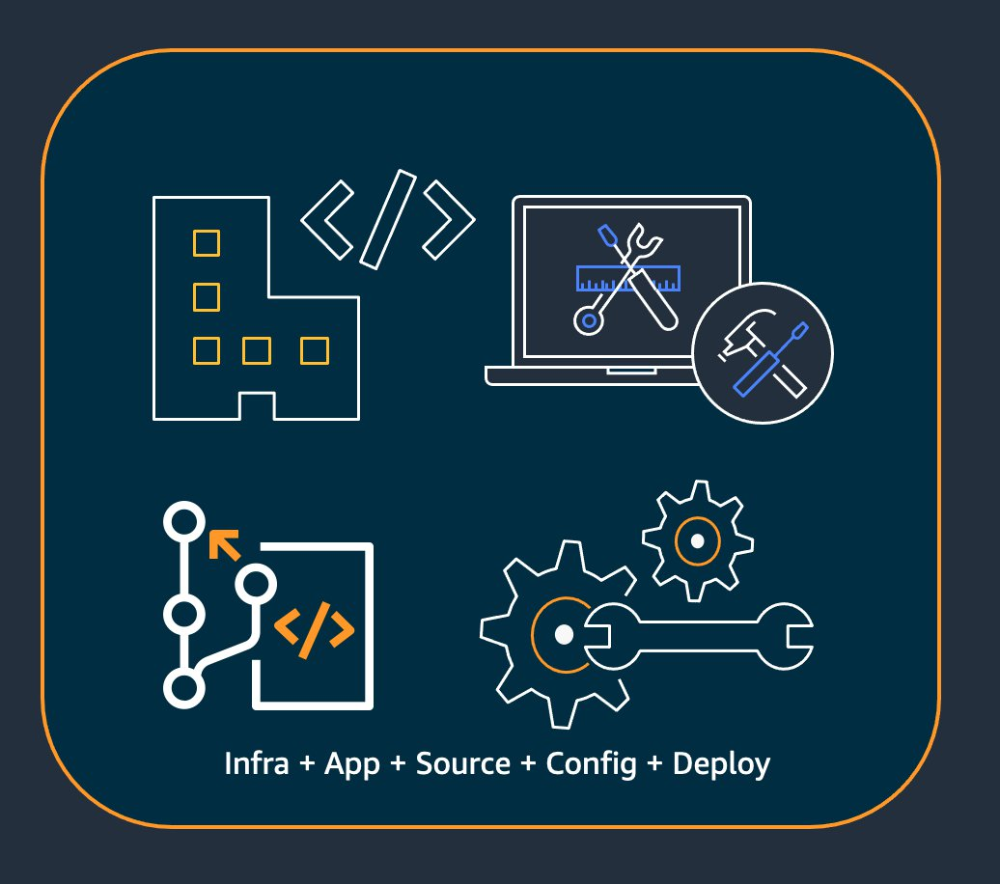

include::../attributes.txt[]

// Attributes

[.topic]
[#best-practices]
= Best practices for developing and deploying cloud infrastructure with the {aws} CDK
:info_titleabbrev: Best practices

// Content start

With the {aws} CDK, developers or administrators can define their cloud infrastructure by using a supported programming language. CDK applications should be organized into logical units, such as API, database, and monitoring resources, and optionally have a pipeline for automated deployments. The logical units should be implemented as constructs including the following:

* Infrastructure (such as Amazon S3 buckets, Amazon RDS databases, or an Amazon VPC network)
* Runtime code (such as {aws} Lambda functions)
* Configuration code

Stacks define the deployment model of these logical units. For a more detailed introduction to the concepts behind the CDK, see xref:getting-started[Getting started with the {aws} CDK].

The {aws} CDK reflects careful consideration of the needs of our customers and internal teams and of the failure patterns that often arise during the deployment and ongoing maintenance of complex cloud applications. We discovered that failures are often related to "out-of-band" changes to an application that aren't fully tested, such as configuration changes. Therefore, we developed the {aws} CDK around a model in which your entire application is defined in code, not only business logic but also infrastructure and configuration. That way, proposed changes can be carefully reviewed, comprehensively tested in environments resembling production to varying degrees, and fully rolled back if something goes wrong.

At deployment time, the {aws} CDK synthesizes a cloud assembly that contains the following:  

* {aws} CloudFormation templates that describe your infrastructure in all target environments 
* File assets that contain your runtime code and their supporting files

With the CDK, every commit in your application's main version control branch can represent a complete, consistent, deployable version of your application. Your application can then be deployed automatically whenever a change is made.

The philosophy behind the {aws} CDK leads to our recommended best practices, which we have divided into four broad categories.

* xref:best-practices-organization[Organization best practices]
* xref:best-practices-code[Coding best practices]
* xref:best-practices-constructs[Construct best practices]
* xref:best-practices-apps[Application best practices]

[TIP]
====

Also consider  https://docs.aws.amazon.com/AWSCloudFormation/latest/UserGuide/best-practices.html[best practices for {aws} CloudFormation] and the individual {aws} services that you use, where applicable to CDK-defined infrastructure.

====

[#best-practices-organization]
== Organization best practices

In the beginning stages of {aws} CDK adoption, it's important to consider how to set up your organization for success. It's a best practice to have a team of experts responsible for training and guiding the rest of the company as they adopt the CDK. The size of this team might vary, from one or two people at a small company to a full-fledged Cloud Center of Excellence (CCoE) at a larger company. This team is responsible for setting standards and policies for cloud infrastructure at your company, and also for training and mentoring developers.

The CCoE might provide guidance on what programming languages should be used for cloud infrastructure. Details will vary from one organization to the next, but a good policy helps make sure that developers can understand and maintain the company's cloud infrastructure.

The CCoE also creates a "landing zone" that defines your organizational units within {aws}. A landing zone is a pre-configured, secure, scalable, multi-account {aws} environment based on best practice blueprints. To tie together the services that make up your landing zone, you can use https://aws.amazon.com/controltower/[{aws} Control Tower], which configures and manages your entire multi-account system from a single user interface.

Development teams should be able to use their own accounts for testing and deploy new resources in these accounts as needed. Individual developers can treat these resources as extensions of their own development workstation. Using xref:cdk-pipeline[CDK Pipelines], the {aws} CDK applications can then be deployed via a CI/CD account to testing, integration, and production environments (each isolated in its own {aws} Region or account). This is done by merging the developers' code into your organization's canonical repository.

image::images/best-practice-deploy-to-multiple-accounts.png[Diagram showing deployment process from developer accounts to multiple target accounts via CI/CD pipeline.,scaledwidth=100%]

[#best-practices-code]
== Coding best practices

This section presents best practices for organizing your {aws} CDK code. The following diagram shows the relationship between a team and that team's code repositories, packages, applications, and construct libraries.  

image::images/code-organization.jpg["Diagram showing team's code organization: repository, package, CDK app or construct library.",scaledwidth=100%]

[#best-practices-code-kiss]
*Start simple and add complexity only when you need it*::
+
The guiding principle for most of our best practices is to keep things simple as possible--but no simpler. Add complexity only when your requirements dictate a more complicated solution. With the {aws} CDK, you can refactor your code as necessary to support new requirements. You don't have to architect for all possible scenarios upfront.

[#best-practices-code-well-architected]
*Align with the {aws} Well-Architected Framework*::
+
The  https://aws.amazon.com/architecture/well-architected/[{aws} Well-Architected] Framework defines a _component_ as the code, configuration, and {aws} resources that together deliver against a requirement. A component is often the unit of technical ownership, and is decoupled from other components. The term _workload_ is used to identify a set of components that together deliver business value. A workload is usually the level of detail that business and technology leaders communicate about.
+
An {aws} CDK application maps to a component as defined by the {aws} Well-Architected Framework. {aws} CDK apps are a mechanism to codify and deliver Well-Architected cloud application best practices. You can also create and share components as reusable code libraries through artifact repositories, such as {aws} CodeArtifact.

[#best-practices-code-package]
*Every application starts with a single package in a single repository*::
+
A single package is the entry point of your {aws} CDK app. Here, you define how and where to deploy the different logical units of your application. You also define the CI/CD pipeline to deploy the application. The app's constructs define the logical units of your solution.
+
Use additional packages for constructs that you use in more than one application. (Shared constructs should also have their own lifecycle and testing strategy.) Dependencies between packages in the same repository are managed by your repo's build tooling. 
+
Although it's possible, we don't recommend putting multiple applications in the same repository, especially when using automated deployment pipelines. Doing this increases the "blast radius" of changes during deployment. When there are multiple applications in a repository, changes to one application trigger deployment of the others (even if the others haven't changed). Furthermore, a break in one application prevents the other applications from being deployed.

[#best-practices-code-repo]
*Move code into repositories based on code lifecycle or team ownership*::
+
When packages begin to be used in multiple applications, move them to their own repository. This way, the packages can be referenced by application build systems that use them, and they can also be updated on cadences independent of the application lifecycles. However, at first it might make sense to put all shared constructs in one repository.
+
Also, move packages to their own repository when different teams are working on them. This helps enforce access control.
+
To consume packages across repository boundaries, you need a private package repository--similar to NPM, PyPi, or Maven Central, but internal to your organization. You also need a release process that builds, tests, and publishes the package to the private package repository. https://docs.aws.amazon.com/codeartifact/latest/ug/[CodeArtifact] can host packages for most popular programming languages.
+
Dependencies on packages in the package repository are managed by your language's package manager, such as NPM for TypeScript or JavaScript applications. Your package manager helps to make sure that builds are repeatable. It does this by recording the specific versions of every package that your application depends on. It also lets you upgrade those dependencies in a controlled manner.
+
Shared packages need a different testing strategy. For a single application, it might be good enough to deploy the application to a testing environment and confirm that it still works. But shared packages must be tested independently of the consuming application, as if they were being released to the public. (Your organization might choose to actually release some shared packages to the public.)
+
Keep in mind that a construct can be arbitrarily simple or complex. A `Bucket` is a construct, but `CameraShopWebsite` could be a construct, too.

[#best-practices-code-all]
*Infrastructure and runtime code live in the same package*::
+
In addition to generating {aws} CloudFormation templates for deploying infrastructure, the {aws} CDK also bundles runtime assets like Lambda functions and Docker images and deploys them alongside your infrastructure. This makes it possible to combine the code that defines your infrastructure and the code that implements your runtime logic into a single construct. It's a best practice to do this. These two kinds of code don't need to live in separate repositories or even in separate packages.
+
To evolve the two kinds of code together, you can use a self-contained construct that completely describes a piece of functionality, including its infrastructure and logic. With a self-contained construct, you can test the two kinds of code in isolation, share and reuse the code across projects, and version all the code in sync.

[#best-practices-constructs]
== Construct best practices

This section contains best practices for developing constructs. Constructs are reusable, composable modules that encapsulate resources. They're the building blocks of {aws} CDK apps.

[#best-practices-constructs-model]
*Model with constructs, deploy with stacks*::
+
Stacks are the unit of deployment: everything in a stack is deployed together. So when building your application's higher-level logical units from multiple {aws} resources, represent each logical unit as a  https://docs.aws.amazon.com/cdk/api/v2/docs/constructs.Construct.html[Construct], not as a https://docs.aws.amazon.com/cdk/api/v2/docs/aws-cdk-lib.Stack.html[Stack]. Use stacks only to describe how your constructs should be composed and connected for your various deployment scenarios.
+
For example, if one of your logical units is a website, the constructs that make it up (such as an Amazon S3 bucket, API Gateway, Lambda functions, or Amazon RDS tables) should be composed into a single high-level construct. Then that construct should be instantiated in one or more stacks for deployment.
+
By using constructs for building and stacks for deploying, you improve reuse potential of your infrastructure and give yourself more flexibility in how it's deployed.

[#best-practices-constructs-config]
*Configure with properties and methods, not environment variables*::
+
Environment variable lookups inside constructs and stacks are a common anti-pattern. Both constructs and stacks should accept a properties object to allow for full configurability completely in code. Doing otherwise introduces a dependency on the machine that the code will run on, which creates yet more configuration information that you have to track and manage.
+
In general, environment variable lookups should be limited to the top level of an {aws} CDK app. They should also be used to pass in information that's needed for running in a development environment. For more information, see xref:environments[Environments for the {aws} CDK].

[#best-practices-constructs-test]
*Unit test your infrastructure*::
+
To consistently run a full suite of unit tests at build time in all environments, avoid network lookups during synthesis and model all your production stages in code. (These best practices are covered later.) If any single commit always results in the same generated template, you can trust the unit tests that you write to confirm that the generated templates look the way you expect. For more information, see  xref:testing[Test {aws} CDK applications].

[#best-practices-constructs-logicalid]
*Don't change the logical ID of stateful resources*::
+
Changing the logical ID of a resource results in the resource being replaced with a new one at the next deployment. For stateful resources like databases and S3 buckets, or persistent infrastructure like an Amazon VPC, this is seldom what you want. Be careful about any refactoring of your {aws} CDK code that could cause the ID to change. Write unit tests that assert that the logical IDs of your stateful resources remain static. The logical ID is derived from the `id` you specify when you instantiate the construct, and the construct's position in the construct tree. For more information, see xref:identifiers-logical-ids[Logical IDs].

[#best-practices-constructs-compliance]
*Constructs aren't enough for compliance*::
+
Many enterprise customers write their own wrappers for L2 constructs (the "curated" constructs that represent individual {aws} resources with built-in sane defaults and best practices). These wrappers enforce security best practices such as static encryption and specific IAM policies. For example, you might create a  `MyCompanyBucket` that you then use in your applications in place of the usual Amazon S3 `Bucket` construct. This pattern is useful for surfacing security guidance early in the software development lifecycle, but don't rely on it as the sole means of enforcement.
+
Instead, use {aws} features such as link:https://docs.aws.amazon.com/organizations/latest/userguide/orgs_manage_policies_scps.html[service control policies] and link:https://docs.aws.amazon.com/IAM/latest/UserGuide/access_policies_boundaries.html[permission boundaries] to enforce your security guardrails at the organization level. Use xref:aspects[Aspects and the {aws} CDK] or tools like https://github.com/aws-cloudformation/cloudformation-guard[CloudFormation Guard] to make assertions about the security properties of infrastructure elements before deployment. Use {aws} CDK for what it does best.
+
Finally, keep in mind that writing your own "L2+" constructs might prevent your developers from taking advantage of {aws} CDK packages such as https://docs.aws.amazon.com/solutions/latest/constructs/welcome.html[{aws} Solutions Constructs] or third-party constructs from Construct Hub. These packages are typically built on standard {aws} CDK constructs and won't be able to use your wrapper constructs.

[#best-practices-apps]
== Application best practices

In this section we discuss how to write your {aws} CDK applications, combining constructs to define how your {aws} resources are connected.

[#best-practices-apps-synth]
*Make decisions at synthesis time*::
+
Although {aws} CloudFormation lets you make decisions at deployment time (using  `Conditions`, `{ Fn::If }`, and `Parameters`), and the {aws} CDK gives you some access to these mechanisms, we recommend against using them. The types of values that you can use and the types of operations you can perform on them are limited compared to what's available in a general-purpose programming language.
+
Instead, try to make all decisions, such as which construct to instantiate, in your {aws} CDK application by using your programming language's `if` statements and other features. For example, a common CDK idiom, iterating over a list and instantiating a construct with values from each item in the list, simply isn't possible using {aws} CloudFormation expressions.
+
Treat {aws} CloudFormation as an implementation detail that the {aws} CDK uses for robust cloud deployments, not as a language target. You're not writing {aws} CloudFormation templates in TypeScript or Python, you're writing CDK code that happens to use CloudFormation for deployment.

[#best-practices-apps-names]
*Use generated resource names, not physical names*::
+
Names are a precious resource. Each name can only be used once. Therefore, if you hardcode a table name or bucket name into your infrastructure and application, you can't deploy that piece of infrastructure twice in the same account. (The name we're talking about here is the name specified by, for example, the `bucketName` property on an Amazon S3 bucket construct.)
+
What's worse, you can't make changes to the resource that require it to be replaced. If a property can only be set at resource creation, such as the `KeySchema` of an Amazon DynamoDB table, then that property is immutable. Changing this property requires a new resource. However, the new resource must have the same name in order to be a true replacement. But it can't have the same name while the existing resource is still using that name.
+
A better approach is to specify as few names as possible. If you omit resource names, the {aws} CDK will generate them for you in a way that won't cause problems. Suppose you have a table as a resource. You can then pass the generated table name as an environment variable into your {aws} Lambda function. In your {aws} CDK application, you can reference the table name as `table.tableName`. Alternatively, you can generate a configuration file on your Amazon EC2 instance on startup, or write the actual table name to the {aws} Systems Manager Parameter Store so your application can read it from there.
+
If the place you need it is another {aws} CDK stack, that's even more straightforward. Supposing that one stack defines the resource and another stack needs to use it, the following applies:
+
* If the two stacks are in the same {aws} CDK app, pass a reference between the two stacks. For example, save a reference to the resource's construct as an attribute of the defining stack (`this.stack.uploadBucket = amzn-s3-demo-bucket`). Then, pass that attribute to the constructor of the stack that needs the resource.
* When the two stacks are in different {aws} CDK apps, use a static `from` method to use an externally defined resource based on its ARN, name, or other attributes. (For example, use `Table.fromArn()` for a DynamoDB table). Use the `CfnOutput` construct to print the ARN or other required value in the output of `cdk deploy`, or look in the {aws} Management Console. Alternatively, the second app can read the CloudFormation template generated by the first app and retrieve that value from the `Outputs` section.

[#best-practices-apps-removal-logs]
*Define removal policies and log retention*::
+
The {aws} CDK attempts to keep you from losing data by defaulting to policies that retain everything you create. For example, the default removal policy on resources that contain data (such as Amazon S3 buckets and database tables) is not to delete the resource when it is removed from the stack. Instead, the resource is orphaned from the stack. Similarly, the CDK's default is to retain all logs forever. In production environments, these defaults can quickly result in the storage of large amounts of data that you don't actually need, and a corresponding {aws} bill.
+
Consider carefully what you want these policies to be for each production resource and specify them accordingly. Use xref:aspects[Aspects and the {aws} CDK] to validate the removal and logging policies in your stack.

[#best-practices-apps-separate]
*Separate your application into multiple stacks as dictated by deployment requirements*::
+
There is no hard and fast rule to how many stacks your application needs. You'll usually end up basing the decision on your deployment patterns. Keep in mind the following guidelines:
+
* It's typically more straightforward to keep as many resources in the same stack as possible, so keep them together unless you know you want them separated.
* Consider keeping stateful resources (like databases) in a separate stack from stateless resources. You can then turn on termination protection on the stateful stack. This way, you can freely destroy or create multiple copies of the stateless stack without risk of data loss.
* Stateful resources are more sensitive to construct renaming--renaming leads to resource replacement. Therefore, don't nest stateful resources inside constructs that are likely to be moved around or renamed (unless the state can be rebuilt if lost, like a cache). This is another good reason to put stateful resources in their own stack.

[#best-practices-apps-context]
*Commit `cdk.context.json` to avoid non-deterministic behavior*::
+
Determinism is key to successful {aws} CDK deployments. An {aws} CDK app should have essentially the same result whenever it is deployed to a given environment.
+
Since your {aws} CDK app is written in a general-purpose programming language, it can execute arbitrary code, use arbitrary libraries, and make arbitrary network calls. For example, you could use an {aws} SDK to retrieve some information from your {aws} account while synthesizing your app. Recognize that doing so will result in additional credential setup requirements, increased latency, and a chance, however small, of failure every time you run `cdk synth`.
+
Never modify your {aws} account or resources during synthesis. Synthesizing an app should not have side effects. Changes to your infrastructure should happen only in the deployment phase, after the {aws} CloudFormation template has been generated. This way, if there's a problem, {aws} CloudFormation can automatically roll back the change. To make changes that can't be easily made within the {aws} CDK framework, use link:https://docs.aws.amazon.com/cdk/api/v2/docs/aws-cdk-lib.custom_resources-readme.html[custom resources] to execute arbitrary code at deployment time.
+
Even strictly read-only calls are not necessarily safe. Consider what happens if the value returned by a network call changes. What part of your infrastructure will that impact? What will happen to already-deployed resources? Following are two example situations in which a sudden change in values might cause a problem.
+
--
* If you provision an Amazon VPC to all available Availability Zones in a specified Region, and the number of AZs is two on deployment day, then your IP space gets split in half. If {aws} launches a new Availability Zone the next day, the next deployment after that tries to split your IP space into thirds, requiring all subnets to be recreated. This probably won't be possible because your Amazon EC2 instances are still running, and you'll have to clean this up manually.
* If you query for the latest Amazon Linux machine image and deploy an Amazon EC2 instance, and the next day a new image is released, a subsequent deployment picks up the new AMI and replaces all your instances. This might not be what you expected to happen.
--
+
These situations can be pernicious because the {aws}-side change might occur after months or years of successful deployments. Suddenly your deployments are failing "for no reason" and you long ago forgot what you did and why.
+
Fortunately, the {aws} CDK includes a mechanism called _context providers_ to record a snapshot of non-deterministic values. This allows future synthesis operations to produce exactly the same template as they did when first deployed. The only changes in the new template are the changes that _you_ made in your code. When you use a construct's `.fromLookup()` method, the result of the call is cached in `cdk.context.json`. You should commit this to version control along with the rest of your code to make sure that future executions of your CDK app use the same value. The CDK Toolkit includes commands to manage the context cache, so you can refresh specific entries when you need to. For more information, see  xref:context[Context values and the {aws} CDK].
+
If you need some value (from {aws} or elsewhere) for which there is no native CDK context provider, we recommend writing a separate script. The script should retrieve the value and write it to a file, then read that file in your CDK app. Run the script only when you want to refresh the stored value, not as part of your regular build process.

[#best-practices-apps-roles]
*Let the {aws} CDK manage roles and security groups*::
+
With the {aws} CDK construct library's `grant()` convenience methods, you can create {aws} Identity and Access Management roles that grant access to one resource by another using minimally scoped permissions. For example, consider a line like the following:
+
[source,javascript,subs="verbatim,attributes"]
----
amzn-s3-demo-bucket.grantRead(myLambda)
----
+
This single line adds a policy to the Lambda function's role (which is also created for you). That role and its policies are more than a dozen lines of CloudFormation that you don't have to write. The {aws} CDK grants only the minimal permissions required for the function to read from the bucket.
+
If you require developers to always use predefined roles that were created by a security team, {aws} CDK coding becomes much more complicated. Your teams could lose a lot of flexibility in how they design their applications. A better alternative is to use link:https://docs.aws.amazon.com/organizations/latest/userguide/orgs_manage_policies_scps.html[service control policies] and link:https://docs.aws.amazon.com/IAM/latest/UserGuide/access_policies_boundaries.html[permission boundaries] to make sure that developers stay within the guardrails.

[#best-practices-apps-stages]
*Model all production stages in code*::
+
In traditional {aws} CloudFormation scenarios, your goal is to produce a single artifact that is parameterized so that it can be deployed to various target environments after applying configuration values specific to those environments. In the CDK, you can, and should, build that configuration into your source code. Create a stack for your production environment, and create a separate stack for each of your other stages. Then, put the configuration values for each stack in the code. Use services like  https://aws.amazon.com/secrets-manager/[Secrets Manager] and https://aws.amazon.com/systems-manager/[Systems Manager] Parameter Store for sensitive values that you don't want to check in to source control, using the names or ARNs of those resources.
+
When you synthesize your application, the cloud assembly created in the `cdk.out` folder contains a separate template for each environment. Your entire build is deterministic. There are no out-of-band changes to your application, and any given commit always yields the exact same {aws} CloudFormation template and accompanying assets. This makes unit testing much more reliable.  

[#best-practices-apps-measure]
*Measure everything*::
+
Achieving the goal of full continuous deployment, with no human intervention, requires a high level of automation. That automation is only possible with extensive amounts of monitoring. To measure all aspects of your deployed resources, create metrics, alarms, and dashboards. Don't stop at measuring things like CPU usage and disk space. Also record your business metrics, and use those measurements to automate deployment decisions like rollbacks. Most of the L2 constructs in {aws} CDK have convenience methods to help you create metrics, such as the `metricUserErrors()` method on the link:https://docs.aws.amazon.com/cdk/api/v2/docs/aws-cdk-lib.aws_dynamodb.Table.html[`dynamodb.Table`] class.

include::best-practices-security.adoc[leveloffset=+1]