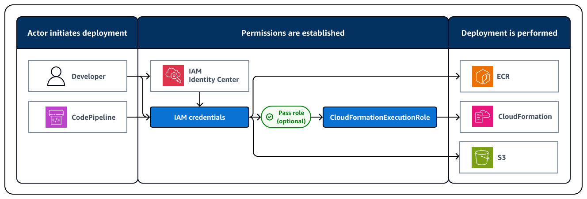

include::../attributes.txt[]

[.topic]
[#customize-synth]
= Customize CDK stack synthesis
:info_titleabbrev: Customize CDK synthesis
:keywords: {aws} CDK,  {aws} CloudFormation stack,  synthesis,  cdk synth,  {aws} CloudFormation template,  Customize

[abstract]
--
You can customize {aws} Cloud Development Kit ({aws} CDK) stack synthesis by modifying the default synthesizer, using other available built-in synthesizers, or create your own synthesizer.
--

// Content start

You can customize {aws} Cloud Development Kit ({aws} CDK) stack synthesis by modifying the default synthesizer, using other available built-in synthesizers, or creating your own synthesizer.

The {aws} CDK includes the following built-in synthesizers that you can use to customize synthesis behavior:

* link:https://docs.aws.amazon.com/cdk/api/v2/docs/aws-cdk-lib.DefaultStackSynthesizer.html[`DefaultStackSynthesizer`] – If you don`'t specify a synthesizer, this one is used automatically. It supports cross-account deployments and deployments using the https://docs.aws.amazon.com/cdk/api/v2/docs/aws-cdk-lib.pipelines-readme.html[CDK Pipelines] construct. Its bootstrap contract requires an existing Amazon S3 bucket with a known name, an existing Amazon ECR repository with a known name, and five existing IAM roles with known names. The default bootstrapping template meets these requirements.
* link:https://docs.aws.amazon.com/cdk/api/v2/docs/aws-cdk-lib.CliCredentialsStackSynthesizer.html[`CliCredentialsStackSynthesizer`] – This synthesizer's bootstrap contract requires an existing Amazon S3 bucket and existing Amazon ECR repository. It does not require any IAM roles. To perform deployments, this synthesizer relies on the permissions of the CDK CLI user and is recommend for organizations that want to restrict IAM deployment credentials. This synthesizer doesn't support cross-account deployments or CDK Pipelines.
* link:https://docs.aws.amazon.com/cdk/api/v2/docs/aws-cdk-lib.LegacyStackSynthesizer.html[`LegacyStackSynthesizer`] – This synthesizer emulates CDK v1 synthesis behavior. Its bootstrap contract requires an existing Amazon S3 bucket of an arbitrary name and expects the locations of assets to be passed in as CloudFormation stack parameters. If you use this synthesizer, you must use the CDK CLI to perform deployment.

If none of these built-in synthesizers are appropriate for your use case, you can write your own synthesizer as a class that implements `IStackSynthesizer` or look at link:https://constructs.dev/search?q=synthesizer&cdk=aws-cdk[synthesizers] from the Construct Hub.

[#bootstrapping-custom-synth-default]
== Customize the `DefaultStackSynthesizer`

The `DefaultStackSynthesizer` is the default synthesizer for the {aws} CDK. It is designed to allow cross-account deployments of CDK applications, as well as deploying CDK apps from a CI/CD system that does not have explicit support for the {aws} CDK, but supports regular CloudFormation deployments, such as {aws} CodePipeline. This synthesizer is the best option for most use cases.

[#bootstrapping-custom-synth-default-contract]
=== `DefaultStackSynthesizer` bootstrap contract

`DefaultStackSynthesizer` requires the following bootstrap contract. These are the resources that must be created during bootstrapping:

[cols="1,1,1,1", frame="all", options="header"]
|===
| Bootstrap resource
| Description
| Default expected resource name
| Purpose

|Amazon S3 bucket
|Staging bucket
|cdk-hnb659fds-assets-<ACCOUNT>-<REGION>
|Stores file assets.

|Amazon ECR repository
|Staging repository
|cdk-hnb659fds-container-assets-<ACCOUNT>-<REGION>
|Stores and manages Docker image assets.

|IAM role
|Deploy role
|cdk-hnb659fds-deploy-role-<ACCOUNT>-<REGION>
|Assumed by the CDK CLI and potentially CodePipeline to assume other roles and start the {aws} CloudFormation deployment.

The trust policy of this role controls who can deploy with the {aws} CDK in this {aws} environment.

|IAM role
|{aws} CloudFormation execution role
|cdk-hnb659fds-cfn-exec-role-<ACCOUNT>-<REGION>
|This role is used by {aws} CloudFormation to perform the deployment.

The policies of this role control what operations the CDK deployment can perform.

|IAM role
|Lookup role
|cdk-hnb659fds-lookup-role-<ACCOUNT>-<REGION>
|This role is used when the CDK CLI needs to perform environmental context lookups.

The trust policy of this role controls who can look up information in the environment.

|IAM role
|File publishing role
|cdk-hnb659fds-file-publishing-role-<ACCOUNT>-<REGION>
|This role is used to upload assets to the Amazon S3 staging bucket. It is assumed from the deploy role.

|IAM role
|Image publishing role
|cdk-hnb659fds-image-publishing-role-<ACCOUNT>-<REGION>
|This role is used to upload Docker images to the Amazon ECR staging repository. It is assumed from the deploy role.

|SSM parameter
|Bootstrap version parameter
|/cdk-bootstrap/hnb659fds/<version>
|The version of the bootstrap template. It is used by the bootstrap template and the CDK CLI to validate requirements.
|===

One way to customize CDK stack synthesis, is by modifying the link:https://docs.aws.amazon.com/cdk/api/v2/docs/aws-cdk-lib.DefaultStackSynthesizer.html[`DefaultStackSynthesizer`]. You can customize this synthesizer for a single CDK stack using the `synthesizer` property of your `Stack` instance. You can also modify `DefaultStackSynthesizer` for all stacks in your CDK app using the `defaultStackSynthesizer` property of your `App` instance.

[#bootstrapping-custom-synth-qualifiers]
=== Change the qualifier

The _qualifier_ is added to the name of resources created during bootstrapping. By default, this value is `hnb659fds`. When you modify the qualifier during bootstrapping, you need to customize CDK stack synthesis to use the same qualifier.

To change the qualifier, configure the `qualifier` property of `DefaultStackSynthesizer` or configure the qualifier as a context key in your CDK project`'s `cdk.json` file.

The following is an example of configuring the `qualifier` property of the `DefaultStackSynthesizer`:

====
[role="tablist"]
TypeScript::
+
[source,javascript,subs="verbatim,attributes"]
----
new MyStack(this, 'MyStack', {
  synthesizer: new DefaultStackSynthesizer({
    qualifier: 'MYQUALIFIER',
  }),
});
----

JavaScript::
+
[source,javascript,subs="verbatim,attributes"]
----
new MyStack(this, 'MyStack', {
  synthesizer: new DefaultStackSynthesizer({
    qualifier: 'MYQUALIFIER',
  }),
})
----

Python::
+
[source,python,subs="verbatim,attributes"]
----
MyStack(self, "MyStack",
    synthesizer=DefaultStackSynthesizer(
        qualifier="MYQUALIFIER"
))
----

Java::
+
[source,java,subs="verbatim,attributes"]
----
new MyStack(app, "MyStack", StackProps.builder()
  .synthesizer(DefaultStackSynthesizer.Builder.create()
    .qualifier("MYQUALIFIER")
    .build())
  .build();
)
----

C#::
+
[source,csharp,subs="verbatim,attributes"]
----
new MyStack(app, "MyStack", new StackProps
{
    Synthesizer = new DefaultStackSynthesizer(new DefaultStackSynthesizerProps
    {
        Qualifier = "MYQUALIFIER"
    })
});
----

Go::
+
[source,go,subs="verbatim,attributes"]
----
func NewMyStack(scope constructs.Construct, id string, props *MyStackProps) awscdk.Stack {
	var sprops awscdk.StackProps
	if props != nil {
		sprops = props.StackProps
	}
	stack := awscdk.NewStack(scope, &id, &sprops)

	synth := awscdk.NewDefaultStackSynthesizer(&awscdk.DefaultStackSynthesizerProps{
		Qualifier: jsii.String("MYQUALIFIER"),
	})

	stack.SetSynthesizer(synth)

	return stack
}
----
====

The following is an example of configuring the qualifier as a context key in `cdk.json`:

[source,json,subs="verbatim,attributes"]
----
{
  "app": "...",
  "context": {
    "@aws-cdk/core:bootstrapQualifier": "MYQUALIFIER"
  }
}
----

[#bootstrapping-custom-synth-names]
=== Change resource names

All of the other `DefaultStackSynthesizer` properties relate to the names of the resources in the bootstrap template. You only need to provide any of these properties if you modified the bootstrap template and changed the resource names or naming scheme.

All properties accept the special placeholders `${Qualifier}`, `${AWS::Partition}`, `${AWS::AccountId}`, and `${AWS::Region}`. These placeholders are replaced with the values of the `qualifier` parameter and the {aws} partition, account ID, and {aws} Region values for the stack's environment, respectively.

The following example shows the most commonly used properties for `DefaultStackSynthesizer` along with their default values, as if you were instantiating the synthesizer. For a complete list, see link:https://docs.aws.amazon.com/cdk/api/v2/docs/aws-cdk-lib.DefaultStackSynthesizerProps.html#properties[`DefaultStackSynthesizerProps`]:

====
[role="tablist"]
TypeScript::
+
[source,javascript]
----
new DefaultStackSynthesizer({
  // Name of the S3 bucket for file assets
  fileAssetsBucketName: 'cdk-${Qualifier}-assets-${AWS::AccountId}-${AWS::Region}',
  bucketPrefix: '',

  // Name of the ECR repository for Docker image assets
  imageAssetsRepositoryName: 'cdk-${Qualifier}-container-assets-${AWS::AccountId}-${AWS::Region}',
  dockerTagPrefix: '',

  // ARN of the role assumed by the CLI and Pipeline to deploy here
  deployRoleArn: 'arn:${AWS::Partition}:iam::${AWS::AccountId}:role/cdk-${Qualifier}-deploy-role-${AWS::AccountId}-${AWS::Region}',
  deployRoleExternalId: '',

  // ARN of the role used for file asset publishing (assumed from the CLI role)
  fileAssetPublishingRoleArn: 'arn:${AWS::Partition}:iam::${AWS::AccountId}:role/cdk-${Qualifier}-file-publishing-role-${AWS::AccountId}-${AWS::Region}',
  fileAssetPublishingExternalId: '',

  // ARN of the role used for Docker asset publishing (assumed from the CLI role)
  imageAssetPublishingRoleArn: 'arn:${AWS::Partition}:iam::${AWS::AccountId}:role/cdk-${Qualifier}-image-publishing-role-${AWS::AccountId}-${AWS::Region}',
  imageAssetPublishingExternalId: '',

  // ARN of the role passed to CloudFormation to execute the deployments
  cloudFormationExecutionRole: 'arn:${AWS::Partition}:iam::${AWS::AccountId}:role/cdk-${Qualifier}-cfn-exec-role-${AWS::AccountId}-${AWS::Region}',

  // ARN of the role used to look up context information in an environment
  lookupRoleArn: 'arn:${AWS::Partition}:iam::${AWS::AccountId}:role/cdk-${Qualifier}-lookup-role-${AWS::AccountId}-${AWS::Region}',
  lookupRoleExternalId: '',

  // Name of the SSM parameter which describes the bootstrap stack version number
  bootstrapStackVersionSsmParameter: '/cdk-bootstrap/${Qualifier}/version',

  // Add a rule to every template which verifies the required bootstrap stack version
  generateBootstrapVersionRule: true,

})
----

JavaScript::
+
[source,javascript]
----
new DefaultStackSynthesizer({
  // Name of the S3 bucket for file assets
  fileAssetsBucketName: 'cdk-${Qualifier}-assets-${AWS::AccountId}-${AWS::Region}',
  bucketPrefix: '',

  // Name of the ECR repository for Docker image assets
  imageAssetsRepositoryName: 'cdk-${Qualifier}-container-assets-${AWS::AccountId}-${AWS::Region}',
  dockerTagPrefix: '',

  // ARN of the role assumed by the CLI and Pipeline to deploy here
  deployRoleArn: 'arn:${AWS::Partition}:iam::${AWS::AccountId}:role/cdk-${Qualifier}-deploy-role-${AWS::AccountId}-${AWS::Region}',
  deployRoleExternalId: '',

  // ARN of the role used for file asset publishing (assumed from the CLI role)
  fileAssetPublishingRoleArn: 'arn:${AWS::Partition}:iam::${AWS::AccountId}:role/cdk-${Qualifier}-file-publishing-role-${AWS::AccountId}-${AWS::Region}',
  fileAssetPublishingExternalId: '',

  // ARN of the role used for Docker asset publishing (assumed from the CLI role)
  imageAssetPublishingRoleArn: 'arn:${AWS::Partition}:iam::${AWS::AccountId}:role/cdk-${Qualifier}-image-publishing-role-${AWS::AccountId}-${AWS::Region}',
  imageAssetPublishingExternalId: '',

  // ARN of the role passed to CloudFormation to execute the deployments
  cloudFormationExecutionRole: 'arn:${AWS::Partition}:iam::${AWS::AccountId}:role/cdk-${Qualifier}-cfn-exec-role-${AWS::AccountId}-${AWS::Region}',

  // ARN of the role used to look up context information in an environment
  lookupRoleArn: 'arn:${AWS::Partition}:iam::${AWS::AccountId}:role/cdk-${Qualifier}-lookup-role-${AWS::AccountId}-${AWS::Region}',
  lookupRoleExternalId: '',

  // Name of the SSM parameter which describes the bootstrap stack version number
  bootstrapStackVersionSsmParameter: '/cdk-bootstrap/${Qualifier}/version',

  // Add a rule to every template which verifies the required bootstrap stack version
  generateBootstrapVersionRule: true,
})
----

Python::
+
[source,python]
----
DefaultStackSynthesizer(
  # Name of the S3 bucket for file assets
  file_assets_bucket_name="cdk-${Qualifier}-assets-${AWS::AccountId}-${AWS::Region}",
  bucket_prefix="",

  # Name of the ECR repository for Docker image assets
  image_assets_repository_name="cdk-${Qualifier}-container-assets-${AWS::AccountId}-${AWS::Region}",
  docker_tag_prefix="",

  # ARN of the role assumed by the CLI and Pipeline to deploy here
  deploy_role_arn="arn:${AWS::Partition}:iam::${AWS::AccountId}:role/cdk-${Qualifier}-deploy-role-${AWS::AccountId}-${AWS::Region}",
  deploy_role_external_id="",

  # ARN of the role used for file asset publishing (assumed from the CLI role)
  file_asset_publishing_role_arn="arn:${AWS::Partition}:iam::${AWS::AccountId}:role/cdk-${Qualifier}-file-publishing-role-${AWS::AccountId}-${AWS::Region}",
  file_asset_publishing_external_id="",

  # ARN of the role used for Docker asset publishing (assumed from the CLI role)
  image_asset_publishing_role_arn="arn:${AWS::Partition}:iam::${AWS::AccountId}:role/cdk-${Qualifier}-image-publishing-role-${AWS::AccountId}-${AWS::Region}",
  image_asset_publishing_external_id="",

  # ARN of the role passed to CloudFormation to execute the deployments
  cloud_formation_execution_role="arn:${AWS::Partition}:iam::${AWS::AccountId}:role/cdk-${Qualifier}-cfn-exec-role-${AWS::AccountId}-${AWS::Region}",

  # ARN of the role used to look up context information in an environment
  lookup_role_arn="arn:${AWS::Partition}:iam::${AWS::AccountId}:role/cdk-${Qualifier}-lookup-role-${AWS::AccountId}-${AWS::Region}",
  lookup_role_external_id="",

  # Name of the SSM parameter which describes the bootstrap stack version number
  bootstrap_stack_version_ssm_parameter="/cdk-bootstrap/${Qualifier}/version",

  # Add a rule to every template which verifies the required bootstrap stack version
  generate_bootstrap_version_rule=True,
)
----

Java::
+
[source,java]
----
DefaultStackSynthesizer.Builder.create()
  // Name of the S3 bucket for file assets
  .fileAssetsBucketName("cdk-${Qualifier}-assets-${AWS::AccountId}-${AWS::Region}")
  .bucketPrefix('')

  // Name of the ECR repository for Docker image assets
  .imageAssetsRepositoryName("cdk-${Qualifier}-container-assets-${AWS::AccountId}-${AWS::Region}")
  .dockerTagPrefix('')

  // ARN of the role assumed by the CLI and Pipeline to deploy here
  .deployRoleArn("arn:${AWS::Partition}:iam::${AWS::AccountId}:role/cdk-${Qualifier}-deploy-role-${AWS::AccountId}-${AWS::Region}")
  .deployRoleExternalId("")

  // ARN of the role used for file asset publishing (assumed from the CLI role)
  .fileAssetPublishingRoleArn("arn:${AWS::Partition}:iam::${AWS::AccountId}:role/cdk-${Qualifier}-file-publishing-role-${AWS::AccountId}-${AWS::Region}")
  .fileAssetPublishingExternalId("")

  // ARN of the role used for Docker asset publishing (assumed from the CLI role)
  .imageAssetPublishingRoleArn("arn:${AWS::Partition}:iam::${AWS::AccountId}:role/cdk-${Qualifier}-image-publishing-role-${AWS::AccountId}-${AWS::Region}")
  .imageAssetPublishingExternalId("")

  // ARN of the role passed to CloudFormation to execute the deployments
  .cloudFormationExecutionRole("arn:${AWS::Partition}:iam::${AWS::AccountId}:role/cdk-${Qualifier}-cfn-exec-role-${AWS::AccountId}-${AWS::Region}")

  .lookupRoleArn("arn:${AWS::Partition}:iam::${AWS::AccountId}:role/cdk-${Qualifier}-lookup-role-${AWS::AccountId}-${AWS::Region}")
  .lookupRoleExternalId("")

  // Name of the SSM parameter which describes the bootstrap stack version number
  .bootstrapStackVersionSsmParameter("/cdk-bootstrap/${Qualifier}/version")

  // Add a rule to every template which verifies the required bootstrap stack version
  .generateBootstrapVersionRule(true)
.build()
----

C#::
+
[source,csharp]
----
new DefaultStackSynthesizer(new DefaultStackSynthesizerProps
{
    // Name of the S3 bucket for file assets
    FileAssetsBucketName = "cdk-${Qualifier}-assets-${AWS::AccountId}-${AWS::Region}",
    BucketPrefix = "",

    // Name of the ECR repository for Docker image assets
    ImageAssetsRepositoryName = "cdk-${Qualifier}-container-assets-${AWS::AccountId}-${AWS::Region}",
    DockerTagPrefix = "",

    // ARN of the role assumed by the CLI and Pipeline to deploy here
    DeployRoleArn = "arn:${AWS::Partition}:iam::${AWS::AccountId}:role/cdk-${Qualifier}-deploy-role-${AWS::AccountId}-${AWS::Region}",
    DeployRoleExternalId = "",

    // ARN of the role used for file asset publishing (assumed from the CLI role)
    FileAssetPublishingRoleArn = "arn:${AWS::Partition}:iam::${AWS::AccountId}:role/cdk-${Qualifier}-file-publishing-role-${AWS::AccountId}-${AWS::Region}",
    FileAssetPublishingExternalId = "",

    // ARN of the role used for Docker asset publishing (assumed from the CLI role)
    ImageAssetPublishingRoleArn = "arn:${AWS::Partition}:iam::${AWS::AccountId}:role/cdk-${Qualifier}-image-publishing-role-${AWS::AccountId}-${AWS::Region}",
    ImageAssetPublishingExternalId = "",

    // ARN of the role passed to CloudFormation to execute the deployments
    CloudFormationExecutionRole = "arn:${AWS::Partition}:iam::${AWS::AccountId}:role/cdk-${Qualifier}-cfn-exec-role-${AWS::AccountId}-${AWS::Region}",

    LookupRoleArn = "arn:${AWS::Partition}:iam::${AWS::AccountId}:role/cdk-${Qualifier}-lookup-role-${AWS::AccountId}-${AWS::Region}",
    LookupRoleExternalId = "",

    // Name of the SSM parameter which describes the bootstrap stack version number
    BootstrapStackVersionSsmParameter = "/cdk-bootstrap/${Qualifier}/version",

    // Add a rule to every template which verifies the required bootstrap stack version
    GenerateBootstrapVersionRule = true,
})
----
====

[#bootstrapping-custom-synth-cli]
== Use `CliCredentialsStackSynthesizer`

To modify the security credentials used to provide permissions during CDK deployments, you can customize synthesis by using link:https://docs.aws.amazon.com/cdk/api/v2/docs/aws-cdk-lib.CliCredentialsStackSynthesizer.html[`CliCredentialsStackSynthesizer`]. This synthesizer works with the default {aws} resources that are created during bootstrapping to store assets, such as the Amazon S3 bucket and Amazon ECR repository. Instead of using the default IAM roles created by the CDK during bootstrapping, it uses the security credentials of the actor initiating deployment. Therefore, the security credentials of the actor must have valid permissions to perform all deployment actions. The following diagram illustrates the deployment process when using this synthesizer:

When using `CliCredentialsStackSynthesizer`:

* By default, CloudFormation performs API calls in your account using the permissions of the actor. Therefore, the current identity must have permission to make necessary changes to the {aws} resources in the CloudFormation stack, along with the permissions to perform necessary CloudFormation operations, such as `CreateStack` or `UpdateStack`. Deployment capabilities will be limited to the permissions of the actor.
* Asset publishing and CloudFormation deployments will be done using the current IAM identity. This identity must have sufficient permissions to both read from and write to the asset bucket and repository.
* Lookups are performed using the current IAM identity, and lookups are subject to its policies.

When using this synthesizer, you can use a separate CloudFormation execution role by specifying it using the xref:ref-cli-cmd-options-role-arn[`--role-arn`] option with any CDK CLI command.

[#bootstrapping-custom-synth-cli-contract]
=== `CliCredentialsStackSynthesizer` bootstrap contract

`CliCredentialsStackSynthesizer` requires the following bootstrap contract. These are the resources that must be created during bootstrapping:

[cols="1,1,1,1", frame="all", options="header"]
|===
| Bootstrap resource
| Description
| Default expected resource name
| Purpose

|Amazon S3 bucket
|Staging bucket
|cdk-hnb659fds-assets-<ACCOUNT>-<REGION>
|Stores file assets.

|Amazon ECR repository
|Staging repository
|cdk-hnb659fds-container-assets-<ACCOUNT>-<REGION>
|Stores and manages Docker image assets.
|===

The string `hnb659fds` in the resource name is called the _qualifier_. Its default value has no special significance. You can have multiple copies of the bootstrap resources in a single environment as long as they have a different qualifier. Having multiple copies can be useful for keeping assets of different applications in the same environment separated.

You can deploy the default bootstrap template to satisfy ``CliCredentialsStackSynthesizer``'s bootstrap contract. The default bootstrap template will create IAM roles, but this synthesizer will not use them. You can also customize the bootstrap template to remove the IAM roles.

[#bootstrapping-custom-synth-cli-modify]
=== Modify `CliCredentialsStackSynthesizer`

If you change the qualifier or any of the default bootstrap resource names during bootstrapping, you have to modify the synthesizer to use the same names. You can modify the synthesizer for a single stack or for all stacks in your app. The following is an example:

====
[role="tablist"]
TypeScript::
+
[source,javascript]
----
new MyStack(this, 'MyStack', {
  synthesizer: new CliCredentialsStackSynthesizer({
    qualifier: 'MYQUALIFIER',
  }),
});
----

JavaScript::
+
[source,javascript]
----
new MyStack(this, 'MyStack', {
  synthesizer: new CliCredentialsStackSynthesizer({
    qualifier: 'MYQUALIFIER',
  }),
})
----

Python::
+
[source,python]
----
MyStack(self, "MyStack",
    synthesizer=CliCredentialsStackSynthesizer(
        qualifier="MYQUALIFIER"
))
----

Java::
+
[source,java]
----
new MyStack(app, "MyStack", StackProps.builder()
  .synthesizer(CliCredentialsStackSynthesizer.Builder.create()
    .qualifier("MYQUALIFIER")
    .build())
  .build();
)
----

C#::
+
[source,csharp]
----
new MyStack(app, "MyStack", new StackProps
{
    Synthesizer = new CliCredentialsStackSynthesizer(new CliCredentialsStackSynthesizerProps
    {
        Qualifier = "MYQUALIFIER"
    })
});
----
====

The following example shows the most commonly used properties for   `CliCredentialsStackSynthesizer` along with their default values. For a complete list, see link:https://docs.aws.amazon.com/cdk/api/v2/docs/aws-cdk-lib.CliCredentialsStackSynthesizerProps.html[`CliCredentialsStackSynthesizerProps`]:

====
[role="tablist"]
TypeScript::
+
[source,javascript]
----
new CliCredentialsStackSynthesizer({
  // Value for '${Qualifier}' in the resource names
  qualifier: 'hnb659fds',

  // Name of the S3 bucket for file assets
  fileAssetsBucketName: 'cdk-${Qualifier}-assets-${AWS::AccountId}-${AWS::Region}',
  bucketPrefix: '',

  // Name of the ECR repository for Docker image assets
  imageAssetsRepositoryName: 'cdk-${Qualifier}-container-assets-${AWS::AccountId}-${AWS::Region}',
  dockerTagPrefix: '',
})
----

JavaScript::
+
[source,javascript]
----
new CliCredentialsStackSynthesizer({
  // Value for '${Qualifier}' in the resource names
  qualifier: 'hnb659fds',

  // Name of the S3 bucket for file assets
  fileAssetsBucketName: 'cdk-${Qualifier}-assets-${AWS::AccountId}-${AWS::Region}',
  bucketPrefix: '',

  // Name of the ECR repository for Docker image assets
  imageAssetsRepositoryName: 'cdk-${Qualifier}-container-assets-${AWS::AccountId}-${AWS::Region}',
  dockerTagPrefix: '',
})
----

Python::
+
[source,python]
----
CliCredentialsStackSynthesizer(
  # Value for '${Qualifier}' in the resource names
  qualifier="hnb659fds",

  # Name of the S3 bucket for file assets
  file_assets_bucket_name="cdk-${Qualifier}-assets-${AWS::AccountId}-${AWS::Region}",
  bucket_prefix="",

  # Name of the ECR repository for Docker image assets
  image_assets_repository_name="cdk-${Qualifier}-container-assets-${AWS::AccountId}-${AWS::Region}",
  docker_tag_prefix="",
)
----

Java::
+
[source,java]
----
CliCredentialsStackSynthesizer.Builder.create()
  // Value for '${Qualifier}' in the resource names
  .qualifier("hnb659fds")

  // Name of the S3 bucket for file assets
  .fileAssetsBucketName("cdk-${Qualifier}-assets-${AWS::AccountId}-${AWS::Region}")
  .bucketPrefix('')

  // Name of the ECR repository for Docker image assets
  .imageAssetsRepositoryName("cdk-${Qualifier}-container-assets-${AWS::AccountId}-${AWS::Region}")
  .dockerTagPrefix('')
.build()
----

C#::
+
[source,csharp]
----
new CliCredentialsStackSynthesizer(new CliCredentialsStackSynthesizerProps
{

    // Value for '${Qualifier}' in the resource names
    Qualifier = "hnb659fds",

    // Name of the S3 bucket for file assets
    FileAssetsBucketName = "cdk-${Qualifier}-assets-${AWS::AccountId}-${AWS::Region}",
    BucketPrefix = "",

    // Name of the ECR repository for Docker image assets
    ImageAssetsRepositoryName = "cdk-${Qualifier}-container-assets-${AWS::AccountId}-${AWS::Region}",
    DockerTagPrefix = "",
})
----
====

[#bootstrapping-custom-synth-legacy]
== Use `LegacyStackSynthesizer`

The `LegacyStackSynthesizer` emulates the behavior of CDK v1 deployments. The security credentials of the actor performing deployment will be used to establish permissions. File assets will be uploaded to a bucket that must be created using a {aws} CloudFormation stack named `CDKToolkit`. The CDK CLI will create an unmanaged Amazon ECR repository named `aws-cdk/assets` to store Docker image assets. You will be responsible to clean up and manage this repository. Stacks synthesized using the `LegacyStackSynthesizer` can only be deployed using the CDK CLI.

You can use the `LegacyStackSynthesizer` if you are migrating from CDK v1 to CDK v2, and are unable to re-bootstrap your environments. For new projects, we recommend that you don't use `LegacyStackSynthesizer`.

[#bootstrapping-custom-synth-legacy-contract]
=== `LegacyStackSynthesizer` bootstrap contract

`LegacyStackSynthesizer` requires the following bootstrap contract. These are the resources that must be created during bootstrapping:

[cols="1,1,1,1", frame="all", options="header"]
|===
| Bootstrap resource
| Description
| Default expected resource name
| Purpose

|Amazon S3 bucket
|Staging bucket
|cdk-hnb659fds-assets-<ACCOUNT>-<REGION>
|Stores file assets.

|CloudFormation output 
|Bucket name output
|Stack – `CDKToolkit`

Output name – `BucketName`
|

A CloudFormation output describing the name of the staging bucket
|===

The   `LegacyStackSynthesizer` does not assume the existence of an Amazon S3 bucket with a fixed name. Instead, the synthesized CloudFormation template will contain three CloudFormation parameters for each file asset. These parameters will store the Amazon S3 bucket name, Amazon S3 object key, and artifact hash for each file asset.

[noloc]``Docker`` image assets will be published to an Amazon ECR repository named   ``aws-cdk/assets``. This name can be changed per asset. The repositories will be created if they do not exist.

A CloudFormation stack must exist with the default name ``CDKToolkit``. This stack must have a CloudFormation export named `BucketName` that refers to the staging bucket.

The default bootstrap template satisfies the `LegacyStackSynthesizer` bootstrap contract. However, only the Amazon S3 bucket from the bootstrap resources of the bootstrap template will be used. You can customize the bootstrap template to remove the Amazon ECR, IAM, and SSM bootstrap resources.

[[bootstrapping-custom-synth-legacy-deploy,bootstrapping-custom-synth-legacy-deploy.title]]
=== `LegacyStackSynthesizer` deployment process

When you use this synthesizer, the following process is performed during deployment:

* The CDK [noloc]``CLI`` looks for a CloudFormation stack named   `CDKToolkit` in your environment. From this stack, the CDK [noloc]``CLI`` reads the CloudFormation output named   ``BucketName``. You can use the `--toolkit-stack-name` option with `cdk deploy` to specify a different stack name.
* The security credentials of the actor initiating deployment will be used to establish permissions for deployment. Therefore, the actor must have sufficient permissions to perform all deployment actions. This includes reading and writing to the Amazon S3 staging bucket, creating and writing to the Amazon ECR repository, starting and monitoring {aws} CloudFormation deployments, and performing any API calls necessary for deployment.
* If necessary, and if permissions are valid, file assets will be published to the Amazon S3 staging bucket.
* If necessary, and if permissions are valid, [noloc]``Docker`` image assets are published to the repository named by the   `repositoryName` property of the asset. The default value is `'aws-cdk/assets'` if you don`'t provide a repository name.
* If permissions are valid, the {aws} CloudFormation deployment is performed. The locations of the Amazon S3 staging bucket and keys are passed as CloudFormation parameters.