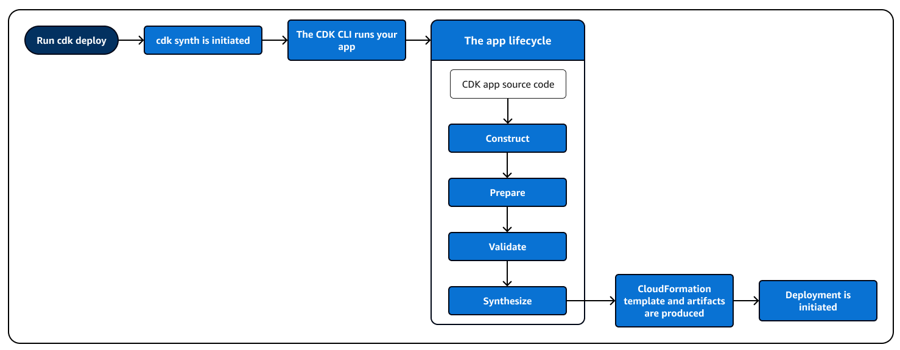
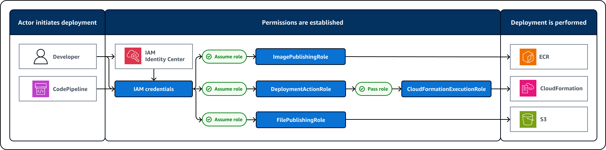

include::../attributes.txt[]

// Attributes

:https---docs-aws-amazon-com-cdk-api-v2-docs-aws-cdk-lib-aws-cloudformation-readme-html: https://docs.aws.amazon.com/cdk/api/v2/docs/aws-cdk-lib.aws_cloudformation-readme.html
:https---docs-aws-amazon-com-cdk-api-v2-docs-aws-cdk-lib-readme-html-stack-synthesizers: https://docs.aws.amazon.com/cdk/api/v2/docs/aws-cdk-lib-readme.html#stack-synthesizers
[.topic]
[#deploy]
= Deploy {aws} CDK applications
:keywords: {aws} CDK, IaC, Infrastructure as code, {aws}, {aws} Cloud, serverless, modern applications

[abstract]
--
An {aws} Cloud Development Kit ({aws} CDK) deployment is the process of provisioning your infrastructure on {aws}.
--

// Content start

An {aws} Cloud Development Kit ({aws} CDK) deployment is the process of provisioning your infrastructure on {aws}.

[#deploy-how]
== How {aws} CDK deployments work

The {aws} CDK utilizes the {aws} CloudFormation service to perform deployments. Before you deploy, you synthesize your CDK stacks. This creates a CloudFormation template and deployment artifacts for each CDK stack in your app. Deployments are initiated from a local development machine or from a _continuous integration and continuous delivery (CI/CD)_ environment. During deployment, assets are uploaded to the bootstrapped resources and the CloudFormation template is submitted to CloudFormation to provision your {aws} resources.

For a deployment to be successful, the following is required:

* The {aws} CDK Command Line Interface ({aws} CDK CLI) must be provided with valid permissions.
* The {aws} environment must be bootstrapped.
* The {aws} CDK must know the bootstrapped resources to upload assets into.

[#deploy-prerequisites]
== Prerequisites for CDK deployments

Before you can deploy an {aws} CDK application, you must complete the following:

* Configure security credentials for the CDK CLI.
* Bootstrap your {aws} environment.
* Configure an {aws} environment for each of your CDK stacks.
* Develop your CDK app.

[#deploy-prerequisites-creds]
*Configure security credentials*::
+
To use the CDK  CLI to interact with {aws}, you must configure security credentials on your local machine. For instructions, see xref:configure-access[Configure security credentials for the {aws} CDK CLI].

[#deploy-prerequisites-bootstrap]
*Bootstrap your {aws} environment*::
+
A deployment is always associated with one or more {aws} xref:environments[environments]. Before you can deploy, the environment must first be xref:bootstrapping[bootstrapped]. Bootstrapping provisions resources in your environment that the CDK uses to perform and manage deployments. These resources include an Amazon Simple Storage Service (Amazon S3) bucket and Amazon Elastic Container Registry (Amazon ECR) repository to store and manage xref:assets[assets]. These resources also include {aws} Identity and Access Management (IAM) roles that are used to provide permissions during development and deployment.
+
We recommend that you use the {aws} CDK Command Line Interface ({aws} CDK CLI) `cdk bootstrap` command to bootstrap your environment. You can customize bootstrapping or manually create these resources in your environment if necessary. For instructions, see xref:bootstrapping-env[Bootstrap your environment for use with the {aws} CDK].

[#deploy-prerequisites-env]
*Configure {aws} environments*::
+
Each CDK stack must be associated with an environment to determine where the stack is deployed to. For instructions, see  xref:configure-env[Configure environments to use with the {aws} CDK].

[#deploy-prerequisites-develop]
*Develop your CDK app*::
+
Within a CDK xref:projects[project], you create and develop your CDK app. Within your app, you create one or more CDK xref:stacks[stacks]. Within your stacks, you import and use xref:constructs[constructs] from the {aws} Construct Library to define your infrastructure. Before you can deploy, your CDK app must contain at least one stack.

[#deploy-how-synth]
== CDK app synthesis

To perform synthesis, we recommend that you use the CDK  CLI `cdk synth` command. The `cdk deploy` command will also perform synthesis before initiating deployment. However, by using `cdk synth`, you can validate your CDK app and catch errors before initiating deployment.

Synthesis behavior is determined by the link:https://docs.aws.amazon.com/cdk/api/v2/docs/aws-cdk-lib-readme.html#stack-synthesizers[stack synthesizer] that you configure for your CDK stack. If you don`'t configure a synthesizer, `https://docs.aws.amazon.com/cdk/api/v2/docs/aws-cdk-lib.DefaultStackSynthesizer.html[DefaultStackSynthesizer]` will be used. You can also configure and customize synthesis to meet your needs. For instructions, see xref:configure-synth[Configure and perform CDK stack synthesis].

For your synthesized CloudFormation template to deploy successfully into your environment, it must be compatible with how your environment was bootstrapped. For example, your CloudFormation template must specify the correct Amazon S3 bucket to deploy assets into. If you use the default method of bootstrapping your environment, the default stack synthesizer will work. If you customize CDK behavior, such as customizing bootstrapping or synthesis, CDK deployment behavior may vary.

[#deploy-how-synth-app]
*The app lifecycle*::
+
When you perform synthesis, your CDK app is run through the following phases, known as the  __app lifecycle__:
+
*Construction (or Initialization)*:::
+
Your code instantiates all of the defined constructs and then links them together. In this stage, all of the constructs (app, stacks, and their child constructs) are instantiated and the constructor chain is run. Most of your app code is run in this stage.
+
*Preparation*:::
All constructs that have implemented the `prepare` method participate in a final round of modifications, to set up their final state. The preparation phase happens automatically. As a user, you don't see any feedback from this phase. It's rare to need to use the "prepare" hook, and generally not recommended. Be very careful when mutating the construct tree during this phase, because the order of operations could impact behavior.
+
During this phase, once the construct tree has been built, any xref:aspects[aspects] that you have configured are applied as well.
+
*Validation*:::
+
All constructs that have implemented the `validate` method can validate themselves to ensure that they're in a state that will correctly deploy. You will get notified of any validation failures that happen during this phase. Generally, we recommend performing validation as soon as possible (usually as soon as you get some input) and throwing exceptions as early as possible. Performing validation early improves reliability as stack traces will be more accurate, and ensures that your code can continue to execute safely.
+
*Synthesis*:::
+
This is the final stage of running your CDK app. It's triggered by a call to `app.synth()`, and it traverses the construct tree and invokes the `synthesize` method on all constructs. Constructs that implement `synthesize` can participate in synthesis and produce deployment artifacts to the resulting cloud assembly. These artifacts include CloudFormation templates, {aws} Lambda application bundles, file and Docker image assets, and other deployment artifacts. In most cases, you won't need to implement the `synthesize` method.

[#deploy-how-synth-run]
*Running your app*::
+
The CDK  CLI needs to know how to run your CDK app. If you created the project from a template using the  `cdk init` command, your app's `cdk.json` file includes an `app` key. This key specifies the necessary command for the language that the app is written in. If your language requires compilation, the command line performs this step before running the app automatically.
+
====
[role="tablist"]
TypeScript::
+
[source,json,subs="verbatim,attributes"]
----
{
  "app": "npx ts-node --prefer-ts-exts bin/my-app.ts"
}
----

JavaScript::
+
[source,json,subs="verbatim,attributes"]
----
{
  "app": "node bin/my-app.js"
}
----

Python::
+
[source,json,subs="verbatim,attributes"]
----
{
    "app": "python app.py"
}
----

Java::
+
[source,json,subs="verbatim,attributes"]
----
{
  "app": "mvn -e -q compile exec:java"
}
----

C#::
+
[source,json,subs="verbatim,attributes"]
----
{
  "app": "dotnet run -p src/MyApp/MyApp.csproj"
}
----

Go::
+
[source,json,subs="verbatim,attributes"]
----
{
  "app": "go mod download && go run my-app.go"
}
----
====
+
If you didn't create your project using the CDK  CLI, or if you want to override the command line given in  `cdk.json`, you can provide the `xref:ref-cli-cmd-options-app[--app]` option when running the `cdk` command.

[source,none,subs="verbatim,attributes"]
----
$ cdk --app '<executable>' <cdk-command> ...
----

The `<executable>` part of the command indicates the command that should be run to execute your CDK application. Use quotation marks as shown, since such commands contain spaces. The `<cdk-command>` is a subcommand like `synth` or `deploy` that tells the CDK CLI what you want to do with your app. Follow this with any additional options needed for that subcommand.

The CDK CLI can also interact directly with an already-synthesized cloud assembly. To do that, pass the directory in which the cloud assembly is stored in `--app`. The following example lists the stacks defined in the cloud assembly stored under `./my-cloud-assembly`.

[source,none,subs="verbatim,attributes"]
----
$ cdk --app <./my-cloud-assembly> ls
----

[#deploy-how-synth-assemblies]
*Cloud assemblies*::
+
The call to `app.synth()` is what tells the {aws} CDK to synthesize a cloud assembly from an app. Typically you don't interact directly with cloud assemblies. They are files that include everything needed to deploy your app to a cloud environment. For example, it includes an {aws} CloudFormation template for each stack in your app. It also includes a copy of any file assets or Docker images that you reference in your app.
+
See the https://github.com/aws/aws-cdk/blob/master/design/cloud-assembly.md[cloud assembly specification] for details on how cloud assemblies are formatted.
+
To interact with the cloud assembly that your {aws} CDK app creates, you typically use the {aws} CDK CLI. However, any tool that can read the cloud assembly format can be used to deploy your app.

[#deploy-how-deploy]
== Deploy your application

To deploy your application, we recommend that you use the CDK  CLI `cdk deploy` command to initiate deployments or to configure automated deployments.

When you run `cdk deploy`, the CDK CLI initiates `cdk synth` to prepare for deployment. The following diagram illustrates the app lifecycle in the context of a deployment:

During deployment, the CDK  CLI takes the cloud assembly produced by synthesis and deploys it to an {aws} environment. Assets are uploaded to Amazon S3 and Amazon ECR and the CloudFormation template is submitted to {aws} CloudFormation for deployment.

By the time the {aws} CloudFormation deployment phase starts, your CDK app has already finished running and exited. This has the following implications:

* The CDK app can't respond to events that happen during deployment, such as a resource being created or the whole deployment finishing. To run code during the deployment phase, you must inject it into the {aws} CloudFormation template as a xref:develop-customize-custom[custom resource]. For more information about adding a custom resource to your app, see the link:https://docs.aws.amazon.com/cdk/api/v2/docs/aws-cdk-lib.aws_cloudformation-readme.html[{aws} CloudFormation module], or the link:https://github.com/aws-samples/aws-cdk-examples/tree/master/typescript/custom-resource/[custom-resource] example. You can also configure the link:https://docs.aws.amazon.com/cdk/api/v2/docs/aws-cdk-lib.triggers-readme.html[Triggers] module to run code during deployments.
* The CDK app might have to work with values that can't be known at the time it runs. For example, if the {aws} CDK app defines an Amazon S3 bucket with an automatically generated name, and you retrieve the `bucket.bucketName` (Python: `bucket_name`) attribute, that value is not the name of the deployed bucket. Instead, you get a `Token` value. To determine whether a particular value is available, call `cdk.isUnresolved(value)` (Python: `is_unresolved`). See xref:tokens[Tokens and the {aws} CDK] for details.

[#deploy-how-deploy-permissions]
*Deployment permissions*::
+
Before deployment can be performed, permissions must be established. The following diagram illustrates the permissions that are used during a default deployment, when using the default bootstrapping process and stack synthesizer:
+

+
*Actor initiates deployment*:::
+
Deployments are initiated by an _actor_, using the CDK CLI. An actor can either be a person, or a service such as {aws} CodePipeline.
+
If necessary, the CDK CLI runs `cdk synth` when you run `cdk deploy`. During synthesis, the {aws} identity assumes the `LookupRole` to perform context lookups in the {aws} environment.
+
*Permissions are established*:::
+
First, the actor's security credentials are used to authenticate to {aws} and obtain the first IAM identity in the process. For human actors, how security credentials are configured and obtained depends on how you or your organization manages users. For more information, see xref:configure-access[Configure security credentials for the {aws} CDK CLI]. For service actors, such as CodePipeline, an IAM execution role is assumed and used.
+
Next, the IAM roles created in your {aws} environment during bootstrapping are used to establish permissions to perform the actions needed for deployment. For more information about these roles and what they grant permissions for, see xref:bootstrapping-env-roles[IAM roles created during bootstrapping]. This process includes the following:
+
--
* The {aws} identity assumes the `DeploymentActionRole` role and passes the `CloudFormationExecutionRole` role to CloudFormation, ensuring that CloudFormation assumes the role when it performs any actions in your {aws} environment. `DeploymentActionRole` grants permission to perform deployments into your environment and `CloudFormationExecutionRole` determines what actions CloudFormation can perform.
* The {aws} identity assumes the `FilePublishingRole`, which determines the actions that can be performed on the Amazon S3 bucket created during bootstrapping.
* The {aws} identity assumes the `ImagePublishingRole`, which determines the actions that can be performed on the Amazon ECR repository created during bootstrapping.
* If necessary, the {aws} identity assumes the `LookupRole` to perform context lookups in the {aws} environment. This action may also be performed during template synthesis.
--
+
*Deployment is performed*:::
+
During deployment, the CDK CLI reads the bootstrap version parameter to confirm the bootstrap version number. {aws} CloudFormation also reads this parameter at deployment time to confirm. If permissions across the deployment workflow are valid, deployment is performed. Assets are uploaded to the bootstrapped resources and the CloudFormation template produced at synthesis is deployed using the CloudFormation service as a CloudFormation stack to provision your resources.

include::policy-validation-synthesis.adoc[leveloffset=+1]

include::create-cdk-pipeline.adoc[leveloffset=+1]

include::build-containers.adoc[leveloffset=+1]

include::deploy-troubleshoot.adoc[leveloffset=+1]