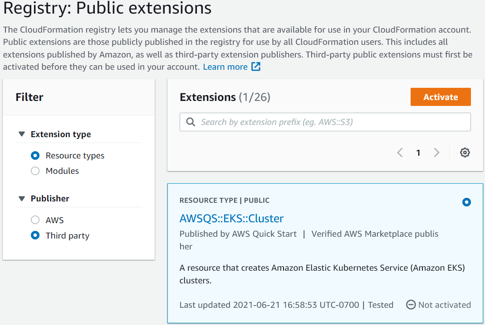

include::../attributes.txt[]

// Attributes

[.topic]
[#use-cfn-public-registry]
= Use resources from the {aws} CloudFormation Public Registry
:info_titleabbrev: Use resources from the CloudFormation Public Registry

// Content start

The {aws} CloudFormation Public Registry lets you manage extensions, both public and private, such as resources, modules, and hooks that are available for use in your {aws} account. You can use public resource extensions in your {aws} Cloud Development Kit ({aws} CDK) applications with the link:https://docs.aws.amazon.com/cdk/api/v2/docs/aws-cdk-lib.CfnResource.html[`CfnResource`] construct. 

To learn more about the {aws} CloudFormation Public Registry, see https://docs.aws.amazon.com/AWSCloudFormation/latest/UserGuide/registry.html[Using the {aws} CloudFormation registry] in the _{aws} CloudFormation User Guide_.

All public extensions published by {aws} are available to all accounts in all Regions without any action on your part. However, you must activate each third-party extension you want to use, in each account and Region where you want to use it. 

[NOTE]
====

When you use {aws} CloudFormation with third-party resource types, you will incur charges. Charges are based on the number of handler operations you run per month and handler operation duration. See https://aws.amazon.com/cloudformation/pricing/[CloudFormation pricing] for complete details.

====

To learn more about public extensions, see https://docs.aws.amazon.com/AWSCloudFormation/latest/UserGuide/registry-public.html[Using public extensions in CloudFormation] in the _{aws} CloudFormation User Guide_

[#use-cfn-public-registry-activate]
== Activate a third-party resource in your account and Region

Extensions published by {aws} do not require activation. They are always available in every account and Region. You can activate a third-party extension through the {aws} Management Console, via the {aws} Command Line Interface, or by deploying a special {aws} CloudFormation resource.

*To activate a third-party extension through the {aws} Management Console or see what resources are available*::
+

+
. Sign in to the {aws} account in which you want to use the extension, then switch to the Region where you want to use it.
. Navigate to the CloudFormation console via the *Services* menu.
. Choose *Public extensions* on the navigation bar, then activate the  *Third party* radio button under  **Publisher**. A list of the available third-party public extensions appears. (You may also choose  *{aws}* to see a list of the public extensions published by {aws}, though you don't need to activate them.)
. Browse the list and find the extension you want to activate. Alternatively, search for it, then activate the radio button in the upper right corner of the extension's card.
. Choose the *Activate* button at the top of the list to activate the selected extension. The extension's  *Activate* page appears.
. In the *Activate* page, you can override the extension's default name and specify an execution role and logging configuration. You can also choose whether to automatically update the extension when a new version is released. When you have set these options as you like, choose  *Activate extension* at the bottom of the page.

*To activate a third-party extension using the {aws} CLI*::
+
* Use the `activate-type` command. Substitute the ARN of the custom type you want to use where indicated.
+
The following is an example:
+
[source,none,subs="verbatim,attributes"]
----
aws cloudformation activate-type --public-type-arn <public_extension_ARN> --auto-update-activated
----

*To activate a third-party extension through CloudFormation or CDK*::
+
. Deploy a resource of type `{aws}::CloudFormation::TypeActivation` and specify the following properties:
+
--
.. `TypeName` - The name of the type, such as ``AWSQS::EKS::Cluster``.
.. `MajorVersion` - The major version number of the extension that you want. Omit if you want the latest version.
.. `AutoUpdate` - Whether to automatically update this extension when a new minor version is released by the publisher. (Major version updates require explicitly changing the `MajorVersion` property.)
.. `ExecutionRoleArn` - The ARN of the IAM role under which this extension will run.
.. `LoggingConfig` - The logging configuration for the extension.
--
+
The `TypeActivation` resource can be deployed by the CDK using the link:https://docs.aws.amazon.com/cdk/api/v2/docs/aws-cdk-lib.CfnResource.html[`CfnResource`] construct. This is shown for the actual extensions in the following section.

[#use-cfn-public-registry-add]
== Add a resource from the {aws} CloudFormation Public Registry to your CDK app

Use the link:https://docs.aws.amazon.com/cdk/api/v2/docs/aws-cdk-lib.CfnResource.html[`CfnResource`] construct to include a resource from the {aws} CloudFormation Public Registry in your application. This construct is in the CDK's `aws-cdk-lib` module. 

For example, suppose that there is a public resource named `MY::S5::UltimateBucket` that you want to use in your {aws} CDK application. This resource takes one property: the bucket name. The corresponding `CfnResource` instantiation looks like this.

====
[role="tablist"]
TypeScript::
+
[source,javascript,subs="verbatim,attributes"]
----
const ubucket = new CfnResource(this, 'MyUltimateBucket', {
    type: 'MY::S5::UltimateBucket::MODULE',
    properties: {
           BucketName: 'UltimateBucket'
    }
});
----

JavaScript::
+
[source,javascript,subs="verbatim,attributes"]
----
const ubucket = new CfnResource(this, 'MyUltimateBucket', {
    type: 'MY::S5::UltimateBucket::MODULE',
    properties: {
           BucketName: 'UltimateBucket'
    }
});
----

Python::
+
[source,python,subs="verbatim,attributes"]
----
ubucket = CfnResource(self, "MyUltimateBucket",
            type="MY::S5::UltimateBucket::MODULE",
            properties=dict(
                BucketName="UltimateBucket"))
----

Java::
+
[source,java,subs="verbatim,attributes"]
----
CfnResource.Builder.create(this, "MyUltimateBucket")
	.type("MY::S5::UltimateBucket::MODULE")
	.properties(java.util.Map.of(    // Map.of requires Java 9+
	    "BucketName", "UltimateBucket"))
	.build();
----

C#::
+
[source,csharp,subs="verbatim,attributes"]
----
new CfnResource(this, "MyUltimateBucket", new CfnResourceProps
{
    Type = "MY::S5::UltimateBucket::MODULE",
    Properties = new Dictionary<string, object>
    {
        ["BucketName"] = "UltimateBucket"
    }
});
----
====