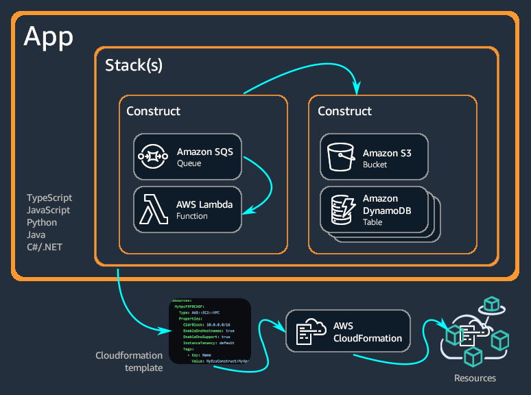
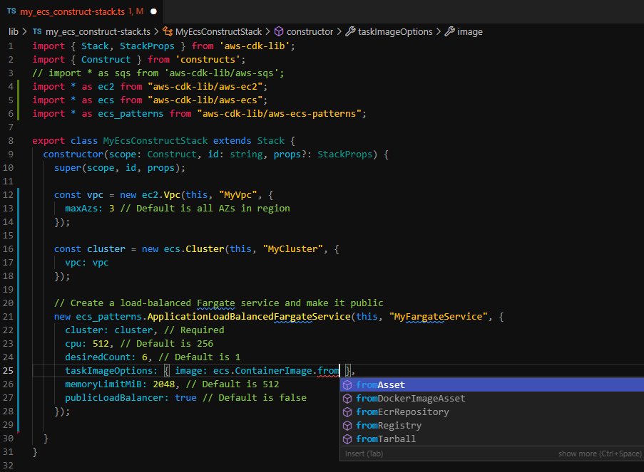

include::attributes.txt[]

:https---github-com-awsdocs-aws-cdk-guide-blob-main-doc-source-my-ecs-construct-stack-yaml: https://github.com/awsdocs/aws-cdk-guide/blob/main/doc_source/my_ecs_construct-stack.yaml
[.topic]
[[home,home.title]]
= What is the {aws} CDK?
:doctype: book
:sectnums:
:toc: left
:icons: font
:experimental:
:idprefix:
:idseparator: -
:sourcedir: .
:info_titleabbrev: What is the {aws} CDK?
:keywords: {aws} CDK, Developer tool, {aws}, Infrastructure as code, IaC, constructs, {aws} CloudFormation, serverless, modern applications

[abstract]
--
The {aws} Cloud Development Kit ({aws} CDK) is an open-source software development framework for defining cloud infrastructure in code and provisioning it through {aws} CloudFormation.
--

The {aws} Cloud Development Kit ({aws} CDK) is an open-source software development framework for defining cloud infrastructure in code and provisioning it through {aws} CloudFormation.

The {aws} CDK consists of two primary parts:

* *xref:constructs[{aws} CDK Construct Library]* – A collection of pre-written modular and reusable pieces of code, called constructs, that you can use, modify, and integrate to develop your infrastructure quickly. The goal of the {aws} CDK Construct Library is to reduce the complexity required to define and integrate {aws} services together when building applications on {aws}.
* *xref:cli[{aws} CDK Command Line Interface ({aws} CDK CLI)]* – A command line tool for interacting with CDK apps. Use the CDK CLI to create, manage, and deploy your {aws} CDK projects. The CDK  CLI is also referred to as the CDK Toolkit.

The {aws} CDK supports  [.noloc]``TypeScript``,  JavaScript,  Python,  Java,  [.noloc]``C#/.Net``, and  [.noloc]``Go``. You can use any of these supported programming languages to define reusable cloud components known as  xref:constructs[constructs]. You compose these together into xref:stacks[stacks] and xref:apps[apps]. Then, you deploy your CDK applications to {aws} CloudFormation to provision or update your resources.

[.topiclist][[Topic List]]

[[home-benefits,home-benefits.title]]
== Benefits of the {aws} CDK

Use the {aws} CDK to develop reliable, scalable, cost-effective applications in the cloud with the considerable expressive power of a programming language. This approach yields many benefits, including:

[[home-benefits-iac]]
Develop and manage your infrastructure as code (IaC)::
Practice _infrastructure as code_ to create, deploy, and maintain infrastructure in a programmatic, descriptive, and declarative way. With IaC, you treat infrastructure the same way developers treat code. This results in a scalable and structured approach to managing infrastructure. To learn more about IaC, see https://docs.aws.amazon.com/whitepapers/latest/introduction-devops-aws/infrastructure-as-code.html[Infrastructure as code] in the __Introduction to DevOps on {aws} Whitepaper__.
+

With the {aws} CDK, you can put your infrastructure, application code, and configuration all in one place, ensuring that you have a complete, cloud-deployable system at every milestone. Employ software engineering best practices such as code reviews, unit tests, and source control to make your infrastructure more robust.

[[home-benefits-languages]]
Define your cloud infrastructure using general-purpose programming languages::
With the {aws} CDK, you can use any of the following programming languages to define your cloud infrastructure: [.noloc]``TypeScript``,  JavaScript,  Python,  Java,  [.noloc]``C#/.Net``, and  [.noloc]``Go``. Choose your preferred language and use programming elements like parameters, conditionals, loops, composition, and inheritance to define the desired outcome of your infrastructure.
+

Use the same programming language to define your infrastructure and your application logic.
+

Receive the benefits of developing infrastructure in your preferred IDE (Integrated Development Environment), such as syntax highlighting and intelligent code completion.
+

[[home-benefits-cfn]]
Deploy infrastructure through {aws} CloudFormation::
{aws} CDK integrates with {aws} CloudFormation to deploy and provision your infrastructure on {aws}. {aws} CloudFormation is a managed {aws} service that offers extensive support of resource and property configurations for provisioning services on {aws}. With {aws} CloudFormation, you can perform infrastructure deployments predictably and repeatedly, with rollback on error. If you are already familiar with {aws} CloudFormation, you don`'t have to learn a new IaC management service when getting started with the {aws} CDK.

[[home-benefits-constructs]]
Get started developing your application quickly with constructs::
Develop faster by using and sharing reusable components called constructs. Use low-level constructs to define individual {aws} CloudFormation resources and their properties. Use high-level constructs to quickly define larger components of your application, with sensible, secure defaults for your {aws} resources, defining more infrastructure with less code.
+

Create your own constructs that are customized for your unique use cases and share them across your organization or even with the public.

[[home-example,home-example.title]]
== Example of the {aws} CDK

The following is an example of using the {aws} CDK Constructs Library to create an Amazon Elastic Container Service (Amazon ECS) service with {aws} Fargate launch type. For more details of this example, see  xref:ecs-example[Example: Create an {aws} Fargate service using the {aws} CDK].

====
[role="tablist"]
TypeScript::
+
[source,javascript,subs="verbatim,attributes"]
----
export class MyEcsConstructStack extends Stack {
  constructor(scope: App, id: string, props?: StackProps) {
    super(scope, id, props);

    const vpc = new ec2.Vpc(this, "MyVpc", {
      maxAzs: 3 // Default is all AZs in region
    });

    const cluster = new ecs.Cluster(this, "MyCluster", {
      vpc: vpc
    });

    // Create a load-balanced Fargate service and make it public
    new ecs_patterns.ApplicationLoadBalancedFargateService(this, "MyFargateService", {
      cluster: cluster, // Required
      cpu: 512, // Default is 256
      desiredCount: 6, // Default is 1
      taskImageOptions: { image: ecs.ContainerImage.fromRegistry("amazon/amazon-ecs-sample") },
      memoryLimitMiB: 2048, // Default is 512
      publicLoadBalancer: true // Default is false
    });
  }
}
----

JavaScript::
+
[source,javascript,subs="verbatim,attributes"]
----
class MyEcsConstructStack extends Stack {
  constructor(scope, id, props) {
    super(scope, id, props);

    const vpc = new ec2.Vpc(this, "MyVpc", {
      maxAzs: 3 // Default is all AZs in region
    });

    const cluster = new ecs.Cluster(this, "MyCluster", {
      vpc: vpc
    });

    // Create a load-balanced Fargate service and make it public
    new ecs_patterns.ApplicationLoadBalancedFargateService(this, "MyFargateService", {
      cluster: cluster, // Required
      cpu: 512, // Default is 256
      desiredCount: 6, // Default is 1
      taskImageOptions: { image: ecs.ContainerImage.fromRegistry("amazon/amazon-ecs-sample") },
      memoryLimitMiB: 2048, // Default is 512
      publicLoadBalancer: true // Default is false
    });
  }
}

module.exports = { MyEcsConstructStack }
----

Python::
+
[source,python,subs="verbatim,attributes"]
----
class MyEcsConstructStack(Stack):

    def __init__(self, scope: Construct, id: str, **kwargs) -> None:
        super().__init__(scope, id, **kwargs)

        vpc = ec2.Vpc(self, "MyVpc", max_azs=3)     # default is all AZs in region

        cluster = ecs.Cluster(self, "MyCluster", vpc=vpc)

        ecs_patterns.ApplicationLoadBalancedFargateService(self, "MyFargateService",
            cluster=cluster,            # Required
            cpu=512,                    # Default is 256
            desired_count=6,            # Default is 1
            task_image_options=ecs_patterns.ApplicationLoadBalancedTaskImageOptions(
                image=ecs.ContainerImage.from_registry("amazon/amazon-ecs-sample")),
            memory_limit_mib=2048,      # Default is 512
            public_load_balancer=True)  # Default is False
----

Java::
+
[source,java,subs="verbatim,attributes"]
----
public class MyEcsConstructStack extends Stack {

    public MyEcsConstructStack(final Construct scope, final String id) {
        this(scope, id, null);
    }

    public MyEcsConstructStack(final Construct scope, final String id,
            StackProps props) {
        super(scope, id, props);

        Vpc vpc = Vpc.Builder.create(this, "MyVpc").maxAzs(3).build();

        Cluster cluster = Cluster.Builder.create(this, "MyCluster")
                .vpc(vpc).build();

        ApplicationLoadBalancedFargateService.Builder.create(this, "MyFargateService")
                .cluster(cluster)
                .cpu(512)
                .desiredCount(6)
                .taskImageOptions(
                       ApplicationLoadBalancedTaskImageOptions.builder()
                               .image(ContainerImage
                                       .fromRegistry("amazon/amazon-ecs-sample"))
                               .build()).memoryLimitMiB(2048)
                .publicLoadBalancer(true).build();
    }
}
----

C#::
+
[source,csharp,subs="verbatim,attributes"]
----
public class MyEcsConstructStack : Stack
{
    public MyEcsConstructStack(Construct scope, string id, IStackProps props=null) : base(scope, id, props)
    {
        var vpc = new Vpc(this, "MyVpc", new VpcProps
        {
            MaxAzs = 3
        });

        var cluster = new Cluster(this, "MyCluster", new ClusterProps
        {
            Vpc = vpc
        });

        new ApplicationLoadBalancedFargateService(this, "MyFargateService", 
            new ApplicationLoadBalancedFargateServiceProps
        {
            Cluster = cluster,
            Cpu = 512,
            DesiredCount = 6,
            TaskImageOptions = new ApplicationLoadBalancedTaskImageOptions
            {
                Image = ContainerImage.FromRegistry("amazon/amazon-ecs-sample")
            },
            MemoryLimitMiB = 2048,
            PublicLoadBalancer = true,
        });
    }
}
----

Go::
+
[source,go,subs="verbatim,attributes"]
----
func NewMyEcsConstructStack(scope constructs.Construct, id string, props *MyEcsConstructStackProps) awscdk.Stack {

	var sprops awscdk.StackProps

	if props != nil {
		sprops = props.StackProps
	}

	stack := awscdk.NewStack(scope, &id, &sprops)

	vpc := awsec2.NewVpc(stack, jsii.String("MyVpc"), &awsec2.VpcProps{
		MaxAzs: jsii.Number(3), // Default is all AZs in region
	})

	cluster := awsecs.NewCluster(stack, jsii.String("MyCluster"), &awsecs.ClusterProps{
		Vpc: vpc,
	})

	awsecspatterns.NewApplicationLoadBalancedFargateService(stack, jsii.String("MyFargateService"),
		&awsecspatterns.ApplicationLoadBalancedFargateServiceProps{
			Cluster:        cluster,           // required
			Cpu:            jsii.Number(512),  // default is 256
			DesiredCount:   jsii.Number(5),    // default is 1
			MemoryLimitMiB: jsii.Number(2048), // Default is 512
			TaskImageOptions: &awsecspatterns.ApplicationLoadBalancedTaskImageOptions{
				Image: awsecs.ContainerImage_FromRegistry(jsii.String("amazon/amazon-ecs-sample"), nil),
			},
			PublicLoadBalancer: jsii.Bool(true), // Default is false
		})

	return stack

}
----
====

This class produces an {aws} CloudFormation  {https---github-com-awsdocs-aws-cdk-guide-blob-main-doc-source-my-ecs-construct-stack-yaml}[template of more than 500 lines]. Deploying the {aws} CDK app produces more than 50 resources of the following types.

* https://docs.aws.amazon.com/AWSCloudFormation/latest/UserGuide/aws-properties-ec2-eip.html[{aws}::EC2::EIP]
* https://docs.aws.amazon.com/AWSCloudFormation/latest/UserGuide/aws-resource-ec2-internetgateway.html[{aws}::EC2::InternetGateway]
* https://docs.aws.amazon.com/AWSCloudFormation/latest/UserGuide/aws-resource-ec2-natgateway.html[{aws}::EC2::NatGateway]
* https://docs.aws.amazon.com/AWSCloudFormation/latest/UserGuide/aws-resource-ec2-route.html[{aws}::EC2::Route]
* https://docs.aws.amazon.com/AWSCloudFormation/latest/UserGuide/aws-resource-ec2-routetable.html[{aws}::EC2::RouteTable]
* https://docs.aws.amazon.com/AWSCloudFormation/latest/UserGuide/aws-properties-ec2-security-group.html[{aws}::EC2::SecurityGroup]
* https://docs.aws.amazon.com/AWSCloudFormation/latest/UserGuide/aws-resource-ec2-subnet.html[{aws}::EC2::Subnet]
* https://docs.aws.amazon.com/AWSCloudFormation/latest/UserGuide/aws-resource-ec2-subnet-route-table-assoc.html[{aws}::EC2::SubnetRouteTableAssociation]
* https://docs.aws.amazon.com/AWSCloudFormation/latest/UserGuide/aws-resource-ec2-vpc-gateway-attachment.html[{aws}::EC2::VPCGatewayAttachment]
* https://docs.aws.amazon.com/AWSCloudFormation/latest/UserGuide/aws-resource-ec2-vpc.html[{aws}::EC2::VPC]
* https://docs.aws.amazon.com/AWSCloudFormation/latest/UserGuide/aws-resource-ecs-cluster.html[{aws}::ECS::Cluster]
* https://docs.aws.amazon.com/AWSCloudFormation/latest/UserGuide/aws-resource-ecs-service.html[{aws}::ECS::Service]
* https://docs.aws.amazon.com/AWSCloudFormation/latest/UserGuide/aws-resource-ecs-taskdefinition.html[{aws}::ECS::TaskDefinition]
* https://docs.aws.amazon.com/AWSCloudFormation/latest/UserGuide/aws-resource-elasticloadbalancingv2-listener.html[{aws}::ElasticLoadBalancingV2::Listener]
* https://docs.aws.amazon.com/AWSCloudFormation/latest/UserGuide/aws-resource-elasticloadbalancingv2-loadbalancer.html[{aws}::ElasticLoadBalancingV2::LoadBalancer]
* https://docs.aws.amazon.com/AWSCloudFormation/latest/UserGuide/aws-resource-elasticloadbalancingv2-targetgroup.html[{aws}::ElasticLoadBalancingV2::TargetGroup]
* https://docs.aws.amazon.com/AWSCloudFormation/latest/UserGuide/aws-resource-iam-policy.html[{aws}::IAM::Policy]
* https://docs.aws.amazon.com/AWSCloudFormation/latest/UserGuide/aws-resource-iam-role.html[{aws}::IAM::Role]
* https://docs.aws.amazon.com/AWSCloudFormation/latest/UserGuide/aws-resource-logs-loggroup.html[{aws}::Logs::LogGroup]

[[home-features,home-features.title]]
== {aws} CDK features

[[home-features-repo,home-features-repo]]
=== The {aws} CDK [.noloc]``GitHub`` repository

For the official {aws} CDK  [.noloc]``GitHub`` repository, see  https://github.com/aws/aws-cdk[aws-cdk]. Here, you can submit https://github.com/aws/aws-cdk/issues[issues], view our https://github.com/aws/aws-cdk/blob/main/LICENSE[license], track https://github.com/aws/aws-cdk/releases[releases], and more.

Because the {aws} CDK is open-source, the team encourages you to contribute to make it an even better tool. For details, see https://github.com/aws/aws-cdk/blob/main/CONTRIBUTING.md[Contributing to the {aws} Cloud Development Kit ({aws} CDK)].

[[home-features-api,home-features-api.title]]
=== The {aws} CDK API reference

The {aws} CDK Construct Library provides APIs to define your CDK application and add CDK constructs to the application. For more information, see the  https://docs.aws.amazon.com/cdk/api/v2/docs/aws-construct-library.html[{aws} CDK API Reference].

[[home-features-cpm,home-features-cpm.title]]
=== The Construct Programming Model

The Construct Programming Model (CPM) extends the concepts behind the {aws} CDK into additional domains. Other tools using the CPM include:

* https://www.terraform.io/docs/cdktf/index.html[CDK for Terraform] (CDKtf)
* https://cdk8s.io/[CDK for Kubernetes] (CDK8s)
* https://github.com/projen/projen[Projen], for building project configurations

[[home-features-hub,home-features-hub.title]]
=== The Construct Hub

The  https://constructs.dev/[Construct Hub] is an online registry where you can find, publish, and share open-source {aws} CDK libraries.

[[home-next,home-next.title]]
== Next steps

To get started with using the {aws} CDK, see  xref:getting-started[Getting started with the {aws} CDK].

[[home-learn,home-learn.title]]
== Learn more

To continue learning about the {aws} CDK, see the following:

* *xref:core-concepts[Learn {aws} CDK core concepts]* – Important concepts and terms for the {aws} CDK.
* *https://cdkworkshop.com/[{aws} CDK Workshop]* – Hands-on workshop to learn and use the {aws} CDK.
* *https://cdkpatterns.com/[{aws} CDK Patterns]* – Open-source collection of {aws} serverless architecture patterns, built for the {aws} CDK by {aws} experts.
* *https://github.com/aws-samples/aws-cdk-examples[{aws} CDK code examples]* – [.noloc]``GitHub`` repository of example {aws} CDK projects.
* *https://cdk.dev/[cdk.dev]* – Community-driven hub for the {aws} CDK, including a community [.noloc]``Slack`` workspace.
* *https://github.com/kalaiser/awesome-cdk[Awesome CDK]* – [.noloc]``GitHub`` repository containing a curated list of {aws} CDK open-source projects, guides, blogs, and other resources.
* *https://aws.amazon.com/solutions/constructs/[{aws} Solutions Constructs]* – Vetted, configuration infrastructure as code (IaC) patterns that can easily be assembled into production-ready applications.
* *https://aws.amazon.com/blogs/developer/category/developer-tools/aws-cloud-development-kit/[{aws} Developer Tools Blog]* – Blog posts filtered for the {aws} CDK.
* *https://stackoverflow.com/questions/tagged/aws-cdk[{aws} CDK on Stack Overflow]* – Questions tagged with * aws-cdk* on [.noloc]``Stack Overflow``.
* *https://docs.aws.amazon.com/cloud9/latest/user-guide/sample-cdk.html[{aws} CDK tutorial for {aws} Cloud9]* – Tutorial on using the {aws} CDK with the {aws} Cloud9 development environment.

To learn more about related topics to the {aws} CDK, see the following:

* *https://docs.aws.amazon.com/AWSCloudFormation/latest/UserGuide/cfn-whatis-concepts.html[{aws} CloudFormation concepts]* – Since the {aws} CDK is built to work with {aws} CloudFormation, we recommend that you learn and understand key {aws} CloudFormation concepts.
* *https://docs.aws.amazon.com/general/latest/gr/glos-chap.html[{aws} Glossary]* – Definitions of key terms used across {aws}.

To learn more about tools related to the {aws} CDK that can be used to simplify serverless application development and deployment, see the following:

* *https://aws.amazon.com/serverless/sam/[{aws} Serverless Application Model]* – An open-source developer tool that simplifies and improves the experience of building and running serverless applications on {aws}.
* *https://github.com/aws/chalice[{aws} Chalice]* – A framework for writing serverless apps in Python.
