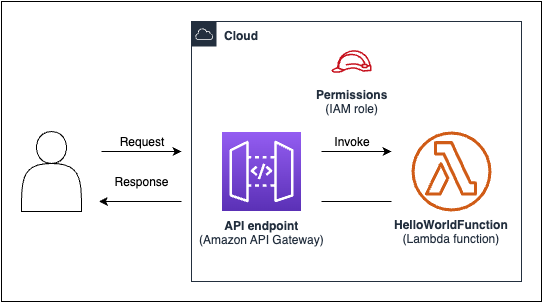

include::attributes.txt[]

// Attributes

:https---docs-aws-amazon-com-cdk-api-v2-docs-aws-cdk-lib-aws-apigateway-readme-html: https://docs.aws.amazon.com/cdk/api/v2/docs/aws-cdk-lib.aws_apigateway-readme.html
:https---docs-aws-amazon-com-cdk-api-v2-docs-aws-cdk-lib-aws-lambda-readme-html: https://docs.aws.amazon.com/cdk/api/v2/docs/aws-cdk-lib.aws_lambda-readme.html

[.topic]
[#serverless-example]
= Tutorial: Create a serverless Hello World application
:info_titleabbrev: Tutorial: Serverless Hello World application
:info_abstract: In this tutorial, you use the {aws} CDK to create a simple serverless Hello World application that implements a basic API backend.
:tcx5-2025-waiver: &#x09;&#x09;&#x20;&#x09;&#x20;&#x09;&#x20;

[abstract]
--
In this tutorial, you use the {aws} CDK to create a simple serverless [.noloc]``Hello World`` application that implements a basic API backend.
--

// Content start

In this tutorial, you use the {aws} Cloud Development Kit ({aws} CDK) to create a simple serverless `Hello World` application that implements a basic API backend consisting of the following:

* *Amazon API Gateway REST API* – Provides an HTTP endpoint that is used to invoke your function through an HTTP GET request.
* *{aws} Lambda function* – Function that returns a `Hello World!` message when invoked with the HTTP endpoint.
* *Integrations and permissions* – Configuration details and permissions for your resources to interact with one another and perform actions, such as writing logs to Amazon CloudWatch.

The following diagram shows the components of this application:

For this tutorial, you will create and interact with your application in the following steps:

. Create an {aws} CDK project.
. Define a Lambda function and API Gateway REST API using L2 constructs from the {aws} Construct Library.
. Deploy your application to the {aws} Cloud.
. Interact with your application in the {aws} Cloud.
. Delete the sample application from the {aws} Cloud.

[#serverless-example-pre]
== Prerequisites

Before starting this tutorial, complete the following:

* Create an {aws} account and have the {aws} Command Line Interface ({aws} CLI) installed and configured.
* Install Node.js and `npm`.
* Install the CDK Toolkit globally, using `npm install -g aws-cdk`.

For more information, see xref:getting-started[Getting started with the {aws} CDK].

We also recommend a basic understanding of the following:

* xref:home[What is the {aws} CDK?] for a basic introduction to the {aws} CDK.
* xref:core-concepts[Learn {aws} CDK core concepts] for an overview of core concepts of the {aws} CDK.

[#serverless-example-project]
== Step 1: Create a CDK project

In this step, you create a new CDK project using the {aws} CDK  CLI `cdk init` command.

*To create a CDK project*::
+
. From a starting directory of your choice, create and navigate to a project directory named `cdk-hello-world` on your machine:
+
[source,none,subs="verbatim,attributes"]
----
$ mkdir cdk-hello-world && cd cdk-hello-world
----
+
. Use the `cdk init` command to create a new project in your preferred programming language:
+
====
[role="tablist"]
TypeScript:::
+
[source,none,subs="verbatim,attributes"]
----
$ cdk init --language typescript
----
+
Install {aws} CDK libraries:
+
[source,none,subs="verbatim,attributes"]
----
$ npm install aws-cdk-lib constructs
----

JavaScript:::
+
[source,none,subs="verbatim,attributes"]
----
$ cdk init --language javascript
----
+
Install {aws} CDK libraries:
+
[source,none,subs="verbatim,attributes"]
----
$ npm install aws-cdk-lib constructs
----

Python:::
+
[source,none,subs="verbatim,attributes"]
----
$ cdk init --language python
----
+
Activate the virtual environment:
+
[source,none,subs="verbatim,attributes"]
----
$ source .venv/bin/activate # On Windows, run '.\venv\Scripts\activate' instead
----
+
Install {aws} CDK libraries and project dependencies:
+
[source,none,subs="verbatim,attributes"]
----
(.venv)$ python3 -m pip install -r requirements.txt
----

Java:::
+
[source,none,subs="verbatim,attributes"]
----
$ cdk init --language java
----
+
Install {aws} CDK libraries and project dependencies:
+
[source,none,subs="verbatim,attributes"]
----
$ mvn package
----

C#:::
+
[source,none,subs="verbatim,attributes"]
----
$ cdk init --language csharp
----
+
Install {aws} CDK libraries and project dependencies:
+
[source,none,subs="verbatim,attributes"]
----
$ dotnet restore src
----

Go:::
+
[source,none,subs="verbatim,attributes"]
----
$ cdk init --language go
----
+
Install project dependencies:
+
[source,none,subs="verbatim,attributes"]
----
$ go get github.com/aws/aws-cdk-go/awscdk/v2
$ go get github.com/aws/aws-cdk-go/awscdk/v2/awslambda
$ go get github.com/aws/aws-cdk-go/awscdk/v2/awsapigateway
$ go mod tidy
----
====
+

The CDK  CLI creates a project with the following structure:
+
====
[role="tablist"]
TypeScript:::
+
[source,none,subs="verbatim,attributes"]
----
cdk-hello-world
├── .git
├── .gitignore
├── .npmignore
├── README.md
├── bin
│   └── cdk-hello-world.ts
├── cdk.json
├── jest.config.js
├── lib
│   └── cdk-hello-world-stack.ts
├── node_modules
├── package-lock.json
├── package.json
├── test
│   └── cdk-hello-world.test.ts
└── tsconfig.json
----

JavaScript:::
+
[source,none,subs="verbatim,attributes"]
----
cdk-hello-world
├── .git
├── .gitignore
├── .npmignore
├── README.md
├── bin
│   └── cdk-hello-world.js
├── cdk.json
├── jest.config.js
├── lib
│   └── cdk-hello-world-stack.js
├── node_modules
├── package-lock.json
├── package.json
└── test
    └── cdk-hello-world.test.js
----

Python:::
+
[source,none,subs="verbatim,attributes"]
----
cdk-hello-world
├── .git
├── .gitignore
├── .venv
├── README.md
├── app.py
├── cdk.json
├── cdk_hello_world
│   ├── __init__.py
│   └── cdk_hello_world_stack.py
├── requirements-dev.txt
├── requirements.txt
├── source.bat
└── tests
----

Java:::
+
[source,none,subs="verbatim,attributes"]
----
cdk-hello-world
├── .git
├── .gitignore
├── README.md
├── cdk.json
├── pom.xml
├── src
│   ├── main
│   │   └── java
│   │       └── com
│   │           └── myorg
│   │               ├── CdkHelloWorldApp.java
│   │               └── CdkHelloWorldStack.java
└── target
----

C#:::
+
[source,none,subs="verbatim,attributes"]
----
cdk-hello-world
├── .git
├── .gitignore
├── README.md
├── cdk.json
└── src
    ├── CdkHelloWorld
    │   ├── CdkHelloWorld.csproj
    │   ├── CdkHelloWorldStack.cs
    │   ├── GlobalSuppressions.cs
    │   └── Program.cs
    └── CdkHelloWorld.sln
----

Go:::
+
[source,none,subs="verbatim,attributes"]
----
cdk-hello-world
├── .git
├── .gitignore
├── README.md
├── cdk-hello-world.go
├── cdk-hello-world_test.go
├── cdk.json
├── go.mod
└── go.sum
----
====

The CDK  CLI automatically creates a CDK app that contains a single stack. The CDK app instance is created from the `link:https://docs.aws.amazon.com/cdk/api/v2/docs/aws-cdk-lib.App.html[App]` class. The following is a portion of your CDK application file:

====
[role="tablist"]
TypeScript::
Located in `bin/cdk-hello-world.ts`:
+
[source,javascript,subs="verbatim,attributes"]
----
#!/usr/bin/env node
import 'source-map-support/register';
import * as cdk from 'aws-cdk-lib';
import { CdkHelloWorldStack } from '../lib/cdk-hello-world-stack';

const app = new cdk.App();
new CdkHelloWorldStack(app, 'CdkHelloWorldStack', {
});
----

JavaScript::
Located in `bin/cdk-hello-world.js`:
+
[source,javascript,subs="verbatim,attributes"]
----
#!/usr/bin/env node
const cdk = require('aws-cdk-lib');
const { CdkHelloWorldStack } = require('../lib/cdk-hello-world-stack');
const app = new cdk.App();
new CdkHelloWorldStack(app, 'CdkHelloWorldStack', {
});
----

Python::
Located in `app.py`:
+
[source,python,subs="verbatim,attributes"]
----
#!/usr/bin/env python3
import os
import aws_cdk as cdk
from cdk_hello_world.cdk_hello_world_stack import CdkHelloWorldStack

app = cdk.App()
CdkHelloWorldStack(app, "CdkHelloWorldStack",)
app.synth()
----

Java::
Located in `src/main/java/.../CdkHelloWorldApp.java`:
+
[source,java,subs="verbatim,attributes"]
----
package com.myorg;

import software.amazon.awscdk.App;
import software.amazon.awscdk.Environment;
import software.amazon.awscdk.StackProps;

import java.util.Arrays;

public class JavaApp {
    public static void main(final String[] args) {
        App app = new App();

        new JavaStack(app, "JavaStack", StackProps.builder()
                .build());

        app.synth();
    }
}
----

C#::
Located in `src/CdkHelloWorld/Program.cs`:
+
[source,csharp,subs="verbatim,attributes"]
----
using Amazon.CDK;
using System;
using System.Collections.Generic;
using System.Linq;

namespace CdkHelloWorld
{
    sealed class Program
    {
        public static void Main(string[] args)
        {
            var app = new App();
            new CdkHelloWorldStack(app, "CdkHelloWorldStack", new StackProps
            {
            
            });
            app.Synth();
        }
    }
}
----

Go::
Located in `cdk-hello-world.go`:
+
[source,go,subs="verbatim,attributes"]
----
package main
import (
    "github.com/aws/aws-cdk-go/awscdk/v2"
    "github.com/aws/constructs-go/constructs/v10"
    "github.com/aws/jsii-runtime-go"
)

// ...

func main() {
    defer jsii.Close()
    app := awscdk.NewApp(nil)
    NewCdkHelloWorldStack(app, "CdkHelloWorldStack", &CdkHelloWorldStackProps{
        awscdk.StackProps{
            Env: env(),
        },
    })
    app.Synth(nil)
}

func env() *awscdk.Environment {
    return nil
}
----
====

[#serverless-example-function]
== Step 2: Create your Lambda function

Within your CDK project, create a `lambda` directory that includes a new `hello.js` file. The following is an example:

====
[role="tablist"]
TypeScript::
From the root of your project, run the following:
+
[source,none,subs="verbatim,attributes"]
----
$ mkdir lambda && cd lambda
$ touch hello.js
----
+
The following should now be added to your CDK project:
+
[source,none,subs="verbatim,attributes"]
----
cdk-hello-world
└── lambda
    └── hello.js
----

JavaScript::
From the root of your project, run the following:
+
[source,none,subs="verbatim,attributes"]
----
$ mkdir lambda && cd lambda
$ touch hello.js
----
+
The following should now be added to your CDK project:
+
[source,none,subs="verbatim,attributes"]
----
cdk-hello-world
└── lambda
    └── hello.js
----

Python::
From the root of your project, run the following:
+
[source,none,subs="verbatim,attributes"]
----
$ mkdir lambda && cd lambda
$ touch hello.js
----
+
The following should now be added to your CDK project:
+
[source,none,subs="verbatim,attributes"]
----
cdk-hello-world
└── lambda
    └── hello.js
----

Java::
From the root of your project, run the following:
+
[source,none,subs="verbatim,attributes"]
----
$ mkdir -p src/main/resources/lambda
$ cd src/main/resources/lambda
$ touch hello.js
----
+
The following should now be added to your CDK project:
+
[source,none,subs="verbatim,attributes"]
----
cdk-hello-world
└── src
    └── main
        └──resources
            └──lambda
                └──hello.js
----

C#::
From the root of your project, run the following:
+
[source,none,subs="verbatim,attributes"]
----
$ mkdir lambda && cd lambda
$ touch hello.js
----
+
The following should now be added to your CDK project:
+
[source,none,subs="verbatim,attributes"]
----
cdk-hello-world
└── lambda
    └── hello.js
----

Go::
From the root of your project, run the following:
+
[source,none,subs="verbatim,attributes"]
----
$ mkdir lambda && cd lambda
$ touch hello.js
----
+
The following should now be added to your CDK project:
+
[source,none,subs="verbatim,attributes"]
----
cdk-hello-world
└── lambda
    └── hello.js
----
====

[NOTE]
====

To keep this tutorial simple, we use a  JavaScript Lambda function for all CDK programming languages.

====

Define your Lambda function by adding the following to the newly created file:

[source,javascript,subs="verbatim,attributes"]
----
exports.handler = async (event) => {
    return {
        statusCode: 200,
        headers: { "Content-Type": "text/plain" },
        body: JSON.stringify({ message: "Hello, World!" }),
    };
};
----

[#serverless-example-constructs]
== Step 3: Define your constructs

In this step, you will define your Lambda and API Gateway resources using {aws} CDK L2 constructs.

Open the project file that defines your CDK stack. You will modify this file to define your constructs. The following is an example of your starting stack file:

====
[role="tablist"]
TypeScript::
Located in `lib/cdk-hello-world-stack.ts`:
+
[source,javascript,subs="verbatim,attributes"]
----
import * as cdk from 'aws-cdk-lib';
import { Construct } from 'constructs';

export class CdkHelloWorldStack extends cdk.Stack {
  constructor(scope: Construct, id: string, props?: cdk.StackProps) {
    super(scope, id, props);
    
    // Your constructs will go here
    
  }
}
----

JavaScript::
Located in `lib/cdk-hello-world-stack.js`:
+
[source,javascript,subs="verbatim,attributes"]
----
const { Stack, Duration } = require('aws-cdk-lib');
const lambda = require('aws-cdk-lib/aws-lambda');
const apigateway = require('aws-cdk-lib/aws-apigateway');

class CdkHelloWorldStack extends Stack {

  constructor(scope, id, props) {
    super(scope, id, props);
    
    // Your constructs will go here
    
  }
}

module.exports = { CdkHelloWorldStack }
----

Python::
Located in `cdk_hello_world/cdk_hello_world_stack.py`:
+
[source,python,subs="verbatim,attributes"]
----
from aws_cdk import Stack
from constructs import Construct

class CdkHelloWorldStack(Stack):
    def __init__(self, scope: Construct, construct_id: str, **kwargs) -> None:
        super().__init__(scope, construct_id, **kwargs)
          
          // Your constructs will go here
----

Java::
Located in `src/main/java/.../CdkHelloWorldStack.java`:
+
[source,java,subs="verbatim,attributes"]
----
package com.myorg;

import software.constructs.Construct;
import software.amazon.awscdk.Stack;
import software.amazon.awscdk.StackProps;

public class CdkHelloWorldStack extends Stack {
    public CdkHelloWorldStack(final Construct scope, final String id) {
        this(scope, id, null);
    }

    public CdkHelloWorldStack(final Construct scope, final String id, final StackProps props) {
        super(scope, id, props);

        // Your constructs will go here
    }
}
----

C#::
Located in `src/CdkHelloWorld/CdkHelloWorldStack.cs`:
+
[source,csharp,subs="verbatim,attributes"]
----
using Amazon.CDK;
using Constructs;

namespace CdkHelloWorld
{
    public class CdkHelloWorldStack : Stack
    {
        internal CdkHelloWorldStack(Construct scope, string id, IStackProps props = null) : base(scope, id, props)
        {
            // Your constructs will go here
        }
    }
}
----

Go::
Located at `cdk-hello-world.go`:
+
[source,go,subs="verbatim,attributes"]
----
package main
            
import (
    "github.com/aws/aws-cdk-go/awscdk/v2"
    "github.com/aws/constructs-go/constructs/v10"
    "github.com/aws/jsii-runtime-go"
)

type CdkHelloWorldStackProps struct {
    awscdk.StackProps
}

func NewCdkHelloWorldStack(scope constructs.Construct, id string, props *CdkHelloWorldStackProps) awscdk.Stack {
    var sprops awscdk.StackProps
    if props != nil {
        sprops = props.StackProps
    }
    stack := awscdk.NewStack(scope, &id, &sprops)
    
    // Your constructs will go here
    
    return stack
}

func main() {

    // ...
    
}

func env() *awscdk.Environment {

    return nil
    
}
----
====

In this file, the {aws} CDK is doing the following:

* Your CDK stack instance is instantiated from the `link:https://docs.aws.amazon.com/cdk/api/v2/docs/aws-cdk-lib.Stack.html[Stack]` class.
* The `link:https://docs.aws.amazon.com/cdk/api/v2/docs/constructs-readme.html[Constructs]` base class is imported and provided as the scope or parent of your stack instance.

[#serverless-example-constructs-lambda]
=== Define your Lambda function resource

To define your Lambda function resource, you import and use the  `link:https://docs.aws.amazon.com/cdk/api/v2/docs/aws-cdk-lib.aws_lambda-readme.html[aws-lambda]` L2 construct from the {aws} Construct Library.

Modify your stack file as follows:

====
[role="tablist"]
TypeScript::
+
[source,javascript,subs="verbatim,attributes"]
----
import * as cdk from 'aws-cdk-lib';
import { Construct } from 'constructs';
// Import Lambda L2 construct
import * as lambda from 'aws-cdk-lib/aws-lambda';

export class CdkHelloWorldStack extends cdk.Stack {
  constructor(scope: Construct, id: string, props?: cdk.StackProps) {
    super(scope, id, props);

    // Define the Lambda function resource
    const helloWorldFunction = new lambda.Function(this, 'HelloWorldFunction', {
      runtime: lambda.Runtime.NODEJS_20_X, // Choose any supported Node.js runtime
      code: lambda.Code.fromAsset('lambda'), // Points to the lambda directory
      handler: 'hello.handler', // Points to the 'hello' file in the lambda directory
    });
  }
}
----

JavaScript::
+
[source,javascript,subs="verbatim,attributes"]
----
const { Stack, Duration } = require('aws-cdk-lib');
// Import Lambda L2 construct
const lambda = require('aws-cdk-lib/aws-lambda');

class CdkHelloWorldStack extends Stack {
  constructor(scope, id, props) {
    super(scope, id, props);

    // Define the Lambda function resource
    const helloWorldFunction = new lambda.Function(this, 'HelloWorldFunction', {
      runtime: lambda.Runtime.NODEJS_20_X, // Choose any supported Node.js runtime
      code: lambda.Code.fromAsset('lambda'), // Points to the lambda directory
      handler: 'hello.handler', // Points to the 'hello' file in the lambda directory
    });
  }
}

module.exports = { CdkHelloWorldStack }
----

Python::
+
[source,python,subs="verbatim,attributes"]
----
from aws_cdk import (
    Stack,
    # Import Lambda L2 construct
    aws_lambda as _lambda,
)
# ...

class CdkHelloWorldStack(Stack):

    def __init__(self, scope: Construct, construct_id: str, **kwargs) -> None:
        super().__init__(scope, construct_id, **kwargs)

        # Define the Lambda function resource
        hello_world_function = _lambda.Function(
            self,
            "HelloWorldFunction",
            runtime = _lambda.Runtime.NODEJS_20_X, # Choose any supported Node.js runtime
            code = _lambda.Code.from_asset("lambda"), # Points to the lambda directory
            handler = "hello.handler", # Points to the 'hello' file in the lambda directory
        )
----
+
NOTE: We import the `aws_lambda` module as `\_lambda` because `lambda` is a build-in identifier in Python.

Java::
+
[source,java,subs="verbatim,attributes"]
----
// ...
// Import Lambda L2 construct
import software.amazon.awscdk.services.lambda.Code;
import software.amazon.awscdk.services.lambda.Function;
import software.amazon.awscdk.services.lambda.Runtime;

public class CdkHelloWorldStack extends Stack {
    public CdkHelloWorldStack(final Construct scope, final String id) {
        this(scope, id, null);
    }

    public CdkHelloWorldStack(final Construct scope, final String id, final StackProps props) {
        super(scope, id, props);

        // Define the Lambda function resource
        Function helloWorldFunction = Function.Builder.create(this, "HelloWorldFunction")
                .runtime(Runtime.NODEJS_20_X)  // Choose any supported Node.js runtime
                .code(Code.fromAsset("src/main/resources/lambda")) // Points to the lambda directory
                .handler("hello.handler")  // Points to the 'hello' file in the lambda directory
                .build();
    }
}
----

C#::
+
[source,csharp,subs="verbatim,attributes"]
----
// ...
// Import Lambda L2 construct
using Amazon.CDK.{aws}.Lambda;

namespace CdkHelloWorld
{
    public class CdkHelloWorldStack : Stack
    {
        internal CdkHelloWorldStack(Construct scope, string id, IStackProps props = null) : base(scope, id, props)
        {
            // Define the Lambda function resource
            var helloWorldFunction = new Function(this, "HelloWorldFunction", new FunctionProps
            {
                Runtime = Runtime.NODEJS_20_X, // Choose any supported Node.js runtime
                Code = Code.FromAsset("lambda"), // Points to the lambda directory
                Handler = "hello.handler" // Points to the 'hello' file in the lambda directory
            });
        }
    }
}
----

Go::
+
[source,go,subs="verbatim,attributes"]
----
package main

import (
    // ...
    // Import Lambda L2 construct
    "github.com/aws/aws-cdk-go/awscdk/v2/awslambda"
    // Import S3 assets construct
    "github.com/aws/aws-cdk-go/awscdk/v2/awss3assets"
    // ...
)

// ...

func NewCdkHelloWorldStack(scope constructs.Construct, id string, props *CdkHelloWorldStackProps) awscdk.Stack {
    var sprops awscdk.StackProps
    if props != nil {
        sprops = props.StackProps
    }
    stack := awscdk.NewStack(scope, &id, &sprops)

    // Define the Lambda function resource
    helloWorldFunction := awslambda.NewFunction(stack, jsii.String("HelloWorldFunction"), &awslambda.FunctionProps{
        Runtime: awslambda.Runtime_NODEJS_20_X(), // Choose any supported Node.js runtime
        Code:    awslambda.Code_FromAsset(jsii.String("lambda"), &awss3assets.AssetOptions{}), // Points to the lambda directory
        Handler: jsii.String("hello.handler"), // Points to the 'hello' file in the lambda directory
    })

    return stack
}

// ...
----
====

Here, you create a Lambda function resource and define the following properties:

* `runtime` – The environment the function runs in. Here, we use Node.js version 20.x.
* `code` – The path to the function code on your local machine.
* `handler` – The name of the specific file that contains your function code.

[#serverless-example-constructs-api]
=== Define your API Gateway REST API resource

To define your API Gateway  [.noloc]``REST API`` resource, you import and use the `link:https://docs.aws.amazon.com/cdk/api/v2/docs/aws-cdk-lib.aws_apigateway-readme.html[aws-apigateway]` L2 construct from the {aws} Construct Library.

Modify your stack file as follows:

====
[role="tablist"]
TypeScript::
+
[source,javascript,subs="verbatim,attributes"]
----
// ...
//Import API Gateway L2 construct
import * as apigateway from 'aws-cdk-lib/aws-apigateway';

export class CdkHelloWorldStack extends cdk.Stack {
  constructor(scope: Construct, id: string, props?: cdk.StackProps) {
    super(scope, id, props);

    // ...
    
    // Define the API Gateway resource
    const api = new apigateway.LambdaRestApi(this, 'HelloWorldApi', {
      handler: helloWorldFunction,
      proxy: false,
    });
        
    // Define the '/hello' resource with a GET method
    const helloResource = api.root.addResource('hello');
    helloResource.addMethod('GET');
  }
}
----

JavaScript::
+
[source,javascript,subs="verbatim,attributes"]
----
// ...
// Import API Gateway L2 construct
const apigateway = require('aws-cdk-lib/aws-apigateway');

class CdkHelloWorldStack extends Stack {
  constructor(scope, id, props) {
    super(scope, id, props);

    // ...

    // Define the API Gateway resource
    const api = new apigateway.LambdaRestApi(this, 'HelloWorldApi', {
      handler: helloWorldFunction, 
      proxy: false,
    });
    
    // Define the '/hello' resource with a GET method
    const helloResource = api.root.addResource('hello');
    helloResource.addMethod('GET');
  };
};

// ...
----

Python::
+
[source,python,subs="verbatim,attributes"]
----
from aws_cdk import (
    # ...
    # Import API Gateway L2 construct
    aws_apigateway as apigateway,
)
from constructs import Construct

class CdkHelloWorldStack(Stack):

    def __init__(self, scope: Construct, construct_id: str, **kwargs) -> None:
        super().__init__(scope, construct_id, **kwargs)

        # ...

        # Define the API Gateway resource
        api = apigateway.LambdaRestApi(
            self,
            "HelloWorldApi",
            handler = hello_world_function,
            proxy = False,
        )
        
        # Define the '/hello' resource with a GET method
        hello_resource = api.root.add_resource("hello")
        hello_resource.add_method("GET")
----

Java::
+
[source,java,subs="verbatim,attributes"]
----
// ...
// Import API Gateway L2 construct
import software.amazon.awscdk.services.apigateway.LambdaRestApi;
import software.amazon.awscdk.services.apigateway.Resource;

public class CdkHelloWorldStack extends Stack {
    public CdkHelloWorldStack(final Construct scope, final String id) {
        this(scope, id, null);
    }

    public CdkHelloWorldStack(final Construct scope, final String id, final StackProps props) {
        super(scope, id, props);

        // ...

        // Define the API Gateway resource
        LambdaRestApi api = LambdaRestApi.Builder.create(this, "HelloWorldApi")
                .handler(helloWorldFunction)
                .proxy(false) // Turn off default proxy integration
                .build();

        // Define the '/hello' resource and its GET method
        Resource helloResource = api.getRoot().addResource("hello");
        helloResource.addMethod("GET");
    }
}
----

C#::
+
[source,csharp,subs="verbatim,attributes"]
----
// ...
// Import API Gateway L2 construct
using Amazon.CDK.{aws}.APIGateway;

namespace CdkHelloWorld
{
    public class CdkHelloWorldStack : Stack
    {
        internal CdkHelloWorldStack(Construct scope, string id, IStackProps props = null) : base(scope, id, props)
        {
           // ...

            // Define the API Gateway resource
            var api = new LambdaRestApi(this, "HelloWorldApi", new LambdaRestApiProps
            {
                Handler = helloWorldFunction,
                Proxy = false
            });

            // Add a '/hello' resource with a GET method
            var helloResource = api.Root.AddResource("hello");
            helloResource.AddMethod("GET");
        }
    }
}
----

Go::
+
[source,go,subs="verbatim,attributes"]
----
// ...

import (
    // ...
    // Import Api Gateway L2 construct
    "github.com/aws/aws-cdk-go/awscdk/v2/awsapigateway"
    // ...
)

// ...

func NewCdkHelloWorldStack(scope constructs.Construct, id string, props *CdkHelloWorldStackProps) awscdk.Stack {
    var sprops awscdk.StackProps
    if props != nil {
        sprops = props.StackProps
    }
    stack := awscdk.NewStack(scope, &id, &sprops)

    // Define the Lambda function resource
    // ...
    
    // Define the API Gateway resource
    api := awsapigateway.NewLambdaRestApi(stack, jsii.String("HelloWorldApi"), &awsapigateway.LambdaRestApiProps{
        Handler: helloWorldFunction,
        Proxy: jsii.Bool(false),
    })

    // Add a '/hello' resource with a GET method
    helloResource := api.Root().AddResource(jsii.String("hello"), &awsapigateway.ResourceOptions{})
    helloResource.AddMethod(jsii.String("GET"), awsapigateway.NewLambdaIntegration(helloWorldFunction, &awsapigateway.LambdaIntegrationOptions{}), &awsapigateway.MethodOptions{})

    return stack
}

// ...
----
====

Here, you create an API Gateway REST API resource, along with the following:

* An integration between the REST API and your Lambda function, allowing the API to invoke your function. This includes the creation of a Lambda permission resource.
* A new resource or path named `hello` that is added to the root of the API endpoint. This creates a new endpoint that adds `/hello` to your base URL.
* A GET method for the `hello` resource. When a GET request is sent to the `/hello` endpoint, the Lambda function is invoked and its response is returned.

[#serverless-example-deploy-prepare]
== Step 4: Prepare your application for deployment

In this step you prepare your application for deployment by building, if necessary, and performing basic validation with the {aws} CDK  CLI `cdk synth` command.

If necessary, build your application:

====
[role="tablist"]
TypeScript::
From the root of your project, run the following:
+
[source,none,subs="verbatim,attributes"]
----
$ npm run build
----

JavaScript::
Building is not required.

Python::
Building is not required.

Java::
From the root of your project, run the following:
+
[source,none,subs="verbatim,attributes"]
----
$ mvn package
----

C#::
From the root of your project, run the following:
+
[source,none,subs="verbatim,attributes"]
----
$ dotnet build src
----

Go::
Building is not required.
====

Run `cdk synth` to synthesize an {aws} CloudFormation template from your CDK code. By using L2 constructs, many of the configuration details required by {aws} CloudFormation to facilitate the interaction between your Lambda function and REST API are provisioned for you by the {aws} CDK.

From the root of your project, run the following:

[source,none,subs="verbatim,attributes"]
----
$ cdk synth
----

[NOTE]
====

If you receive an error like the following, verify that you are in the `cdk-hello-world` directory and try again:

----
--app is required either in command-line, in cdk.json or in ~/.cdk.json
----

====

If successful, the {aws} CDK  CLI will output the {aws} CloudFormation template in `YAML` format at the command prompt. A `JSON` formatted template is also saved in the `cdk.out` directory.

The following is an example output of the {aws} CloudFormation template:

[#serverless-example-deploy-cfn]
.{aws} CloudFormation template
[%collapsible]
====

[source,yaml,subs="verbatim,attributes"]
----
Resources:
  HelloWorldFunctionServiceRoleunique-identifier:
    Type: {aws}::IAM::Role
    Properties:
      AssumeRolePolicyDocument:
        Statement:
          - Action: sts:AssumeRole
            Effect: Allow
            Principal:
              Service: lambda.amazonaws.com
        Version: "2012-10-17"{tcx5-2025-waiver}
      ManagedPolicyArns:
        - Fn::Join:
            - ""
            - - "arn:"
              - Ref: {aws}::Partition
              - :iam::aws:policy/service-role/AWSLambdaBasicExecutionRole
    Metadata:
      aws:cdk:path: CdkHelloWorldStack/HelloWorldFunction/ServiceRole/Resource
  HelloWorldFunctionunique-identifier:
    Type: {aws}::Lambda::Function
    Properties:
      Code:
        S3Bucket:
          Fn::Sub: cdk-unique-identifier-assets-${{aws}::AccountId}-${{aws}::Region}
        S3Key: unique-identifier.zip
      Handler: hello.handler
      Role:
        Fn::GetAtt:
          - HelloWorldFunctionServiceRoleunique-identifier
          - Arn
      Runtime: nodejs20.x
    DependsOn:
      - HelloWorldFunctionServiceRoleunique-identifier
    Metadata:
      aws:cdk:path: CdkHelloWorldStack/HelloWorldFunction/Resource
      aws:asset:path: asset.unique-identifier
      aws:asset:is-bundled: false
      aws:asset:property: Code
  HelloWorldApiunique-identifier:
    Type: {aws}::ApiGateway::RestApi
    Properties:
      Name: HelloWorldApi
    Metadata:
      aws:cdk:path: CdkHelloWorldStack/HelloWorldApi/Resource
  HelloWorldApiDeploymentunique-identifier:
    Type: {aws}::ApiGateway::Deployment
    Properties:
      Description: Automatically created by the RestApi construct
      RestApiId:
        Ref: HelloWorldApiunique-identifier
    DependsOn:
      - HelloWorldApihelloGETunique-identifier
      - HelloWorldApihellounique-identifier
    Metadata:
      aws:cdk:path: CdkHelloWorldStack/HelloWorldApi/Deployment/Resource
  HelloWorldApiDeploymentStageprod012345ABC:
    Type: {aws}::ApiGateway::Stage
    Properties:
      DeploymentId:
        Ref: HelloWorldApiDeploymentunique-identifier
      RestApiId:
        Ref: HelloWorldApiunique-identifier
      StageName: prod
    Metadata:
      aws:cdk:path: CdkHelloWorldStack/HelloWorldApi/DeploymentStage.prod/Resource
  HelloWorldApihellounique-identifier:
    Type: {aws}::ApiGateway::Resource
    Properties:
      ParentId:
        Fn::GetAtt:
          - HelloWorldApiunique-identifier
          - RootResourceId
      PathPart: hello
      RestApiId:
        Ref: HelloWorldApiunique-identifier
    Metadata:
      aws:cdk:path: CdkHelloWorldStack/HelloWorldApi/Default/hello/Resource
  HelloWorldApihelloGETApiPermissionCdkHelloWorldStackHelloWorldApiunique-identifier:
    Type: {aws}::Lambda::Permission
    Properties:
      Action: lambda:InvokeFunction
      FunctionName:
        Fn::GetAtt:
          - HelloWorldFunctionunique-identifier
          - Arn
      Principal: apigateway.amazonaws.com
      SourceArn:
        Fn::Join:
          - ""
          - - "arn:"
            - Ref: {aws}::Partition
            - ":execute-api:"
            - Ref: {aws}::Region
            - ":"
            - Ref: {aws}::AccountId
            - ":"
            - Ref: HelloWorldApi9E278160
            - /
            - Ref: HelloWorldApiDeploymentStageprodunique-identifier
            - /GET/hello
    Metadata:
      aws:cdk:path: CdkHelloWorldStack/HelloWorldApi/Default/hello/GET/ApiPermission.CdkHelloWorldStackHelloWorldApiunique-identifier.GET..hello
  HelloWorldApihelloGETApiPermissionTestCdkHelloWorldStackHelloWorldApiunique-identifier:
    Type: {aws}::Lambda::Permission
    Properties:
      Action: lambda:InvokeFunction
      FunctionName:
        Fn::GetAtt:
          - HelloWorldFunctionunique-identifier
          - Arn
      Principal: apigateway.amazonaws.com
      SourceArn:
        Fn::Join:
          - ""
          - - "arn:"
            - Ref: {aws}::Partition
            - ":execute-api:"
            - Ref: {aws}::Region
            - ":"
            - Ref: {aws}::AccountId
            - ":"
            - Ref: HelloWorldApiunique-identifier
            - /test-invoke-stage/GET/hello
    Metadata:
      aws:cdk:path: CdkHelloWorldStack/HelloWorldApi/Default/hello/GET/ApiPermission.Test.CdkHelloWorldStackHelloWorldApiunique-identifier.GET..hello
  HelloWorldApihelloGETunique-identifier:
    Type: {aws}::ApiGateway::Method
    Properties:
      AuthorizationType: NONE
      HttpMethod: GET
      Integration:
        IntegrationHttpMethod: POST
        Type: AWS_PROXY
        Uri:
          Fn::Join:
            - ""
            - - "arn:"
              - Ref: {aws}::Partition
              - ":apigateway:"
              - Ref: {aws}::Region
              - :lambda:path/2015-03-31/functions/
              - Fn::GetAtt:
                  - HelloWorldFunctionunique-identifier
                  - Arn
              - /invocations
      ResourceId:
        Ref: HelloWorldApihellounique-identifier
      RestApiId:
        Ref: HelloWorldApiunique-identifier
    Metadata:
      aws:cdk:path: CdkHelloWorldStack/HelloWorldApi/Default/hello/GET/Resource
  CDKMetadata:
    Type: {aws}::CDK::Metadata
    Properties:
      Analytics: v2:deflate64:unique-identifier
    Metadata:
      aws:cdk:path: CdkHelloWorldStack/CDKMetadata/Default
    Condition: CDKMetadataAvailable
Outputs:
  HelloWorldApiEndpointunique-identifier:
    Value:
      Fn::Join:
        - ""
        - - https://
          - Ref: HelloWorldApiunique-identifier
          - .execute-api.
          - Ref: {aws}::Region
          - "."
          - Ref: {aws}::URLSuffix
          - /
          - Ref: HelloWorldApiDeploymentStageprodunique-identifier
          - /
Conditions:
  CDKMetadataAvailable:
    Fn::Or:
      - Fn::Or:
          - Fn::Equals:
              - Ref: {aws}::Region
              - af-south-1
          - Fn::Equals:
              - Ref: {aws}::Region
              - ap-east-1
          - Fn::Equals:
              - Ref: {aws}::Region
              - ap-northeast-1
          - Fn::Equals:
              - Ref: {aws}::Region
              - ap-northeast-2
          - Fn::Equals:
              - Ref: {aws}::Region
              - ap-south-1
          - Fn::Equals:
              - Ref: {aws}::Region
              - ap-southeast-1
          - Fn::Equals:
              - Ref: {aws}::Region
              - ap-southeast-2
          - Fn::Equals:
              - Ref: {aws}::Region
              - ca-central-1
          - Fn::Equals:
              - Ref: {aws}::Region
              - cn-north-1
          - Fn::Equals:
              - Ref: {aws}::Region
              - cn-northwest-1
      - Fn::Or:
          - Fn::Equals:
              - Ref: {aws}::Region
              - eu-central-1
          - Fn::Equals:
              - Ref: {aws}::Region
              - eu-north-1
          - Fn::Equals:
              - Ref: {aws}::Region
              - eu-south-1
          - Fn::Equals:
              - Ref: {aws}::Region
              - eu-west-1
          - Fn::Equals:
              - Ref: {aws}::Region
              - eu-west-2
          - Fn::Equals:
              - Ref: {aws}::Region
              - eu-west-3
          - Fn::Equals:
              - Ref: {aws}::Region
              - il-central-1
          - Fn::Equals:
              - Ref: {aws}::Region
              - me-central-1
          - Fn::Equals:
              - Ref: {aws}::Region
              - me-south-1
          - Fn::Equals:
              - Ref: {aws}::Region
              - sa-east-1
      - Fn::Or:
          - Fn::Equals:
              - Ref: {aws}::Region
              - us-east-1
          - Fn::Equals:
              - Ref: {aws}::Region
              - us-east-2
          - Fn::Equals:
              - Ref: {aws}::Region
              - us-west-1
          - Fn::Equals:
              - Ref: {aws}::Region
              - us-west-2
Parameters:
  BootstrapVersion:
    Type: {aws}::SSM::Parameter::Value<String>
    Default: /cdk-bootstrap/hnb659fds/version
    Description: Version of the CDK Bootstrap resources in this environment, automatically retrieved from SSM Parameter Store. [cdk:skip]
Rules:
  CheckBootstrapVersion:
    Assertions:
      - Assert:
          Fn::Not:
            - Fn::Contains:
                - - "1"
                  - "2"
                  - "3"
                  - "4"
                  - "5"
                - Ref: BootstrapVersion
        AssertDescription: CDK bootstrap stack version 6 required. Please run 'cdk bootstrap' with a recent version of the CDK CLI.
----
====

By using L2 constructs, you define a few properties to configure your resources and use helper methods to integrate them together. The {aws} CDK configures the majority of your {aws} CloudFormation resources and properties required to provision your application.

[#serverless-example-deploy]
== Step 5: Deploy your application

In this step, you use the {aws} CDK  CLI `cdk deploy` command to deploy your application. The {aws} CDK works with the {aws} CloudFormation service to provision your resources.

[IMPORTANT]
====

You must perform a one-time bootstrapping of your {aws} environment before deployment. For instructions, see xref:bootstrapping-env[Bootstrap your environment for use with the {aws} CDK].

====

From the root of your project, run the following. Confirm changes if prompted:

[source,none,subs="verbatim,attributes"]
----
$ cdk deploy

✨  Synthesis time: 2.44s

...

Do you wish to deploy these changes (y/n)? <y>
----

When deployment completes, the {aws} CDK CLI will output your endpoint URL. Copy this URL for the next step. The following is an example:

[source,none,subs="verbatim,attributes"]
----
...
✅  HelloWorldStack

✨  Deployment time: 45.37s

Outputs:
HelloWorldStack.HelloWorldApiEndpointunique-identifier = https://<api-id>.execute-api.<region>.amazonaws.com/prod/
Stack ARN:
arn:aws:cloudformation:region:account-id:stack/HelloWorldStack/unique-identifier
...
----

[#serverless-example-interact]
== Step 6: Interact with your application

In this step, you initiate a GET request to your API endpoint and receive your Lambda function response.

Locate your endpoint URL from the previous step and add the `/hello` path. Then, using your browser or command prompt, send a GET request to your endpoint. The following is an example:

[source,none,subs="verbatim,attributes"]
----
$ curl https://<api-id>.execute-api.<region>.amazonaws.com/prod/hello
{"message":"Hello World!"}%
----

Congratulations, you have successfully created, deployed, and interacted with your application using the {aws} CDK!  

[#serverless-example-delete]
== Step 7: Delete your application

In this step, you use the {aws} CDK  CLI to delete your application from the {aws} Cloud.

To delete your application, run `cdk destroy`. When prompted, confirm your request to delete the application:

[source,none,subs="verbatim,attributes"]
----
$ cdk destroy
Are you sure you want to delete: CdkHelloWorldStack (y/n)? y
CdkHelloWorldStack: destroying... [1/1]
...
 ✅  CdkHelloWorldStack: destroyed
----

[#serverless-example-troubleshooting]
== Troubleshooting

[#serverless-example-trobuleshooting-error1]
=== Error: {"`message`": "`Internal server error`"}%

When invoking the deployed Lambda function, you receive this error. This error could occur for multiple reasons.

*To troubleshoot further*::
+
Use the {aws} CLI to invoke your Lambda function.
+
. Modify your stack file to capture the output value of your deployed Lambda function name. The following is an example:
+
[source,javascript,subs="verbatim,attributes"]
----
...

class CdkHelloWorldStack extends Stack {
  constructor(scope, id, props) {
    super(scope, id, props);

    // Define the Lambda function resource
    // ...

    new CfnOutput(this, 'HelloWorldFunctionName', {
      value: helloWorldFunction.functionName,
      description: 'JavaScript Lambda function'
    });

    // Define the API Gateway resource
    // ...
  }
}
----
+
. Deploy your application again. The {aws} CDK CLI will output the value of your deployed Lambda function name:
+
[source,none,subs="verbatim,attributes"]
----
$ cdk deploy

✨  Synthesis time: 0.29s
...
 ✅  CdkHelloWorldStack

✨  Deployment time: 20.36s

Outputs:
...
CdkHelloWorldStack.HelloWorldFunctionName = CdkHelloWorldStack-HelloWorldFunctionunique-identifier
...
----
+
. Use the {aws} CLI to invoke your Lambda function in the {aws} Cloud and output the response to a text file:
+
[source,none,subs="verbatim,attributes"]
----
$ aws lambda invoke --function-name CdkHelloWorldStack-HelloWorldFunctionunique-identifier output.txt
----
+
. Check `output.txt` to see your results.
+

*Possible cause: API Gateway resource is defined incorrectly in your stack file*:::
+
If `output.txt` shows a successful Lambda function response, the issue could be with how you defined your API Gateway REST API. The {aws} CLI invokes your Lambda directly, not through your endpoint. Check your code to ensure it matches this tutorial. Then, deploy again.
+
*Possible cause: Lambda resource is defined incorrectly in your stack file*:::
If `output.txt` returns an error, the issue could be with how you defined your Lambda function. Check your code to ensure it matches this tutorial. Then deploy again.