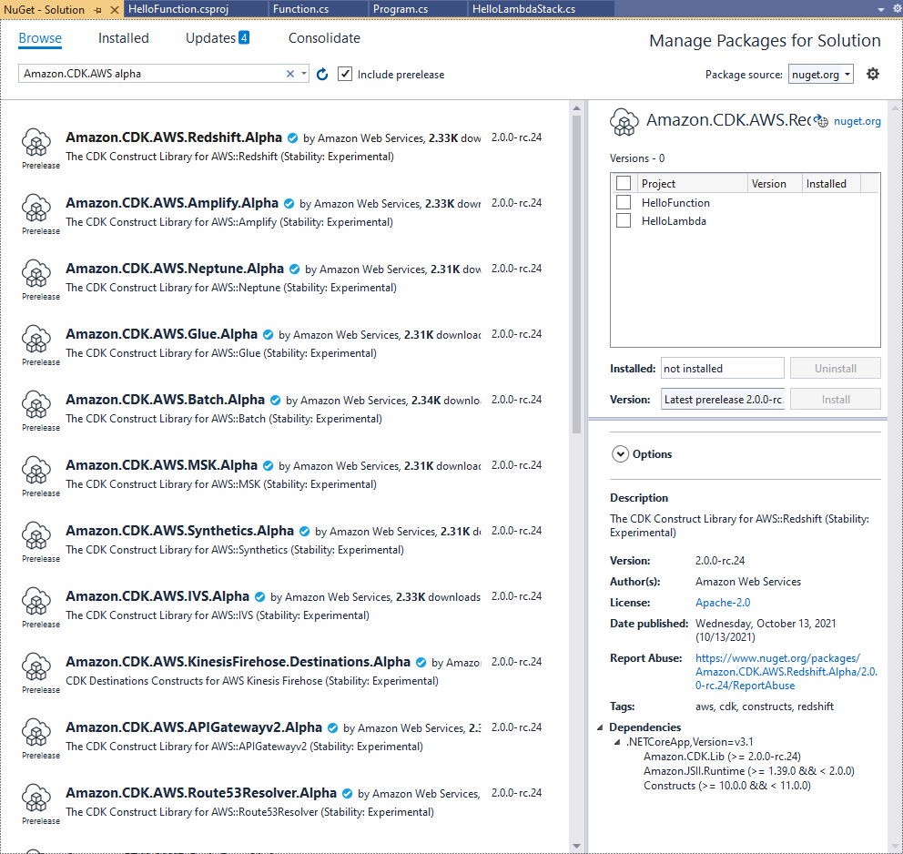

include::../attributes.txt[]

// Attributes
[.topic]
[#work-with-cdk-csharp]
= Working with the {aws} CDK in C#
:info_titleabbrev: In C#

// Content start

+++.NET+++ is a fully-supported client language for the {aws} CDK and is considered stable. C# is the main .NET language for which we provide examples and support. You can choose to write {aws} CDK applications in other .NET languages, such as Visual Basic or F#, but {aws} offers limited support for using these languages with the CDK.

You can develop {aws} CDK applications in C# using familiar tools including Visual Studio, Visual Studio Code, the `dotnet` command, and the NuGet package manager. The modules comprising the {aws} Construct Library are distributed via https://www.nuget.org/packages?q=amazon.cdk.aws[nuget.org].

We suggest using https://visualstudio.microsoft.com/downloads/[Visual Studio 2019] (any edition) on Windows to develop {aws} CDK apps in C#.

[#csharp-prerequisites]
== Get started with C#

To work with the {aws} CDK, you must have an {aws} account and credentials and have installed Node.js and the {aws} CDK Toolkit. See xref:getting-started[Getting started with the {aws} CDK].

C# {aws} CDK applications require .NET Core v3.1 or later, available https://dotnet.microsoft.com/download/dotnet-core/3.1[here].

The .NET toolchain includes `dotnet`, a command-line tool for building and running .NET applications and managing NuGet packages. Even if you work mainly in Visual Studio, this command can be useful for batch operations and for installing {aws} Construct Library packages.

[#csharp-newproject]
== Creating a project

You create a new {aws} CDK project by invoking `cdk init` in an empty directory. Use the `--language` option and specify `csharp`:

[source,none,subs="verbatim,attributes"]
----
mkdir my-project
cd my-project
cdk init app --language csharp
----

`cdk init` uses the name of the project folder to name various elements of the project, including classes, subfolders, and files. Hyphens in the folder name are converted to underscores. However, the name should otherwise follow the form of a C# identifier; for example, it should not start with a number or contain spaces. 

The resulting project includes a reference to the `Amazon.CDK.Lib` NuGet package. It and its dependencies are installed automatically by NuGet.

[#csharp-managemodules]
== Managing {aws} Construct Library modules

The .NET ecosystem uses the NuGet package manager. The main CDK package, which contains the core classes and all stable service constructs, is `Amazon.CDK.Lib`. Experimental modules, where new functionality is under active development, are named like  `Amazon.CDK.{aws}.<SERVICE-NAME>.Alpha`, where the service name is a short name without an {aws} or Amazon prefix. For example, the NuGet package name for the {aws} IoT module is `Amazon.CDK.{aws}.IoT.Alpha`. If you can't find a package you want, https://www.nuget.org/packages?q=amazon.cdk.aws[search Nuget.org].

[NOTE]
====

The https://docs.aws.amazon.com/cdk/api/latest/dotnet/api/index.html[.NET edition of the CDK API Reference] also shows the package names.

====

Some services' {aws} Construct Library support is in more than one module. For example, {aws} IoT has a second module named `Amazon.CDK.{aws}.IoT.Actions.Alpha`.

The {aws} CDK's main module, which you'll need in most {aws} CDK apps, is imported in C# code as `Amazon.CDK`. Modules for the various services in the {aws} Construct Library live under `Amazon.CDK.{aws}`. For example, the Amazon S3 module's namespace is `Amazon.CDK.{aws}.S3`.

We recommend writing C# `using` directives for the CDK core constructs and for each {aws} service you use in each of your C# source files. You may find it convenient to use an alias for a namespace or type to help resolve name conflicts. You can always use a type's fully-qualfiied name (including its namespace) without a `using` statement.

[#work-with-cdk-csharp-dependencies]
== Managing dependencies in C#

In C# {aws} CDK apps, you manage dependencies using NuGet. NuGet has four standard, mostly equivalent interfaces. Use the one that suits your needs and working style. You can also use compatible tools, such as https://fsprojects.github.io/Paket/[Paket] or https://www.myget.org/[MyGet] or even edit the `.csproj` file directly.

NuGet does not let you specify version ranges for dependencies. Every dependency is pinned to a specific version.

After updating your dependencies, Visual Studio will use NuGet to retrieve the specified versions of each package the next time you build. If you are not using Visual Studio, use the `dotnet restore` command to update your dependencies.

[#manage-dependencies-csharp-direct-edit]
=== Editing the project file directly

Your project's `.csproj` file contains an `<ItemGroup>` container that lists your dependencies as `<PackageReference` elements.

[source,none,subs="verbatim,attributes"]
----
<ItemGroup>
    <PackageReference Include="Amazon.CDK.Lib" Version="2.14.0" />
    <PackageReference Include="Constructs" Version="%constructs-version%" />
</ItemGroup>
----

[#manage-dependencies-csharp-vs-nuget-gui]
=== The Visual Studio NuGet GUI

Visual Studio's NuGet tools are accessible from  *Tools* > *NuGet Package Manager* > *Manage NuGet Packages for Solution*. Use the  *Browse* tab to find the {aws} Construct Library packages you want to install. You can choose the desired version, including prerelease versions of your modules, and add them to any of the open projects.  

[NOTE]
====

All {aws} Construct Library modules deemed "experimental" (see xref:versioning[{aws} CDK versioning]) are flagged as prerelease in NuGet and have an `alpha` name suffix.

====

Look on the *Updates* page to install new versions of your packages.

[#manage-dependencies-csharp-vs-nuget-console]
=== The NuGet console

The NuGet console is a PowerShell-based interface to NuGet that works in the context of a Visual Studio project. You can open it in Visual Studio by choosing  *Tools* > *NuGet Package Manager* > *Package Manager Console*. For more information about using this tool, see  https://docs.microsoft.com/en-us/nuget/consume-packages/install-use-packages-powershell[Install and Manage Packages with the Package Manager Console in Visual Studio].

[#manage-dependencies-csharp-vs-dotnet-command]
=== The `dotnet` command

The `dotnet` command is the primary command line tool for working with Visual Studio C# projects. You can invoke it from any Windows command prompt. Among its many capabilities, `dotnet` can add NuGet dependencies to a Visual Studio project.

Assuming you're in the same directory as the Visual Studio project (`.csproj`) file, issue a command like the following to install a package. Because the main CDK library is included when you create a project, you only need to explicitly install experimental modules. Experimental modules require you to specify an explicit version number.

[source,none,subs="verbatim,attributes"]
----
dotnet add package Amazon.CDK.{aws}.IoT.Alpha -v <VERSION-NUMBER>
----

You can issue the command from another directory. To do so, include the path to the project file, or to the directory that contains it, after the `add` keyword. The following example assumes that you are in your {aws} CDK project's main directory.

[source,none,subs="verbatim,attributes"]
----
dotnet add src/<PROJECT-DIR> package Amazon.CDK.{aws}.IoT.Alpha -v <VERSION-NUMBER>
----

To install a specific version of a package, include the  `-v` flag and the desired version.

To update a package, issue the same `dotnet add` command you used to install it. For experimental modules, again, you must specify an explicit version number.

For more information about managing packages using the `dotnet` command, see https://docs.microsoft.com/en-us/nuget/consume-packages/install-use-packages-dotnet-cli[Install and Manage Packages Using the dotnet CLI].

[#manage-dependencies-csharp-vs-nuget-command]
=== The `nuget` command

The `nuget` command line tool can install and update NuGet packages. However, it requires your Visual Studio project to be set up differently from the way `cdk init` sets up projects. (Technical details: `nuget` works with `Packages.config` projects, while `cdk init` creates a newer-style `PackageReference` project.)

We do not recommend the use of the `nuget` tool with {aws} CDK projects created by `cdk init`. If you are using another type of project, and want to use `nuget`, see the https://docs.microsoft.com/en-us/nuget/reference/nuget-exe-cli-reference[NuGet CLI Reference].

[#csharp-cdk-idioms]
== {aws} CDK idioms in C#

[#csharp-props]
=== Props

All {aws} Construct Library classes are instantiated using three arguments: the _scope_ in which the construct is being defined (its parent in the construct tree), an _id_, and _props_, a bundle of key/value pairs that the construct uses to configure the resources it creates. Other classes and methods also use the "bundle of attributes" pattern for arguments.

In C#, props are expressed using a props type. In idiomatic C# fashion, we can use an object initializer to set the various properties. Here we're creating an Amazon S3 bucket using the `Bucket` construct; its corresponding props type is `BucketProps`.

[source,csharp,subs="verbatim,attributes"]
----
var bucket = new Bucket(this, "amzn-s3-demo-bucket", new BucketProps {
    Versioned = true
});
----

[TIP]
====

Add the package `Amazon.JSII.Analyzers` to your project to get required-values checking in your props definitions inside Visual Studio.

====

When extending a class or overriding a method, you may want to accept additional props for your own purposes that are not understood by the parent class. To do this, subclass the appropriate props type and add the new attributes.

[source,csharp,subs="verbatim,attributes"]
----
// extend BucketProps for use with MimeBucket
class MimeBucketProps : BucketProps {
    public string MimeType { get; set; }
}

// hypothetical bucket that enforces MIME type of objects inside it
class MimeBucket : Bucket {
     public MimeBucket( readonly Construct scope, readonly string id, readonly MimeBucketProps props=null) : base(scope, id, props) {
         // ...
     }
}

// instantiate our MimeBucket class 
var bucket = new MimeBucket(this, "amzn-s3-demo-bucket", new MimeBucketProps {
    Versioned = true,
    MimeType = "image/jpeg"
});
----

When calling the parent class's initializer or overridden method, you can generally pass the props you received. The new type is compatible with its parent, and extra props you added are ignored.

A future release of the {aws} CDK could coincidentally add a new property with a name you used for your own property. This won't cause any technical issues using your construct or method (since your property isn't passed "up the chain," the parent class or overridden method will simply use a default value) but it may cause confusion for your construct's users. You can avoid this potential problem by naming your properties so they clearly belong to your construct. If there are many new properties, bundle them into an appropriately-named class and pass them as a single property.

[#csharp-generic-structures]
=== Generic structures

In some APIs, the {aws} CDK uses JavaScript arrays or untyped objects as input to a method. (See, for example, {aws} CodeBuild's link:https://docs.aws.amazon.com/cdk/api/v2/docs/aws-cdk-lib.aws_codebuild.BuildSpec.html[`BuildSpec.fromObject()`] method.) In C#, these objects are represented as `System.Collections.Generic.Dictionary<String, Object>`. In cases where the values are all strings, you can use `Dictionary<String, String>`. JavaScript arrays are represented as `object[]` or `string[]` array types in C#.

[TIP]
====

You might define short aliases to make it easier to work with these specific dictionary types.

[source,csharp,subs="verbatim,attributes"]
----
using StringDict = System.Collections.Generic.Dictionary<string, string>;
using ObjectDict = System.Collections.Generic.Dictionary<string, object>;
----

====

[#csharp-missing-values]
=== Missing values

In C#, missing values in {aws} CDK objects such as props are represented by `null`. The null-conditional member access operator `?.` and the null coalescing operator `??` are convenient for working with these values.

[source,csharp,subs="verbatim,attributes"]
----
// mimeType is null if props is null or if props.MimeType is null
string mimeType = props?.MimeType;

// mimeType defaults to text/plain. either props or props.MimeType can be null
string MimeType = props?.MimeType ?? "text/plain";
----

[#csharp-running]
== Build and run CDK appliations

The {aws} CDK automatically compiles your app before running it. However, it can be useful to build your app manually to check for errors and run tests. You can do this by pressing F6 in Visual Studio or by issuing `dotnet build src` from the command line, where `src` is the directory in your project directory that contains the Visual Studio Solution (`.sln`) file.